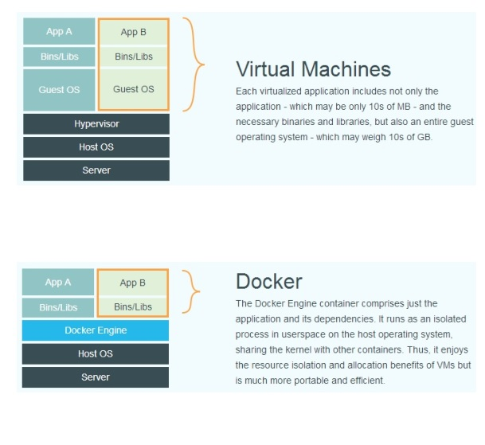

#### Docker-从入门到实践

Docker是一个划时代的项目，彻底释放了计算虚拟化的威力，极大提高了应用的维护效率、降低了云计算
应用开发的成本。使用Docker使得应用的部署、测试和分发都变得轻松和高效。

- Docker简介

     传统虚拟机技术是虚拟出一套硬件之后，在其上运行一个完整的操作系统，在该操作系统上
     再运行所需应用进程；而容器内的应用进程直接运行于宿主的内核，容器内没有自己的内核，
     而且也没有进行硬件虚拟。因此容器相比传统虚拟机更为轻便。
     
     
     由于不需进行硬件虚拟以及运行完整的操作系统，Docker对系统的利用率更高。开发过程中
     常见的问题就是环境一致性问题。由于开发环境、测试环境、生产环境不一致，导致有些
     bug在开发过程未被发现。Docker的镜像提供了除内核外完整的运行时环境，保证了应用的
     环境一致性。
     
     对于开发和运维人员来说，最希望的就是一次创建或配置，可以在任意地方正常运行。使用Docker
     可以通过定制应用镜像来实现持续集成、持续交付、部署。
     
     - 基本概念
     
        Docker包括三个基本概念
        
        - 镜像（Image）
        - 容器（Container）
        - 仓库（Repository）
        
        理解了这三个概念，就理解了Docker的整个生命周期。
        
     - Docker镜像
     
        操作系统分为内核和用户空间。对Linux而言，内核启动后，会挂载root文件为其提供用户空间
        支持。而Docker镜像（Image），就相当于一个root文件系统，除了运行时所需的程序、库、资源、
        配置等文件外，还包含了一些为运行时准备的一些配置参数。镜像不包含任何动态数据，其内容
        在构建之后也不会被改变。
        
     - Docker容器
     
        镜像与容器的关系，就像是类与实例一样。镜像是静态的定义