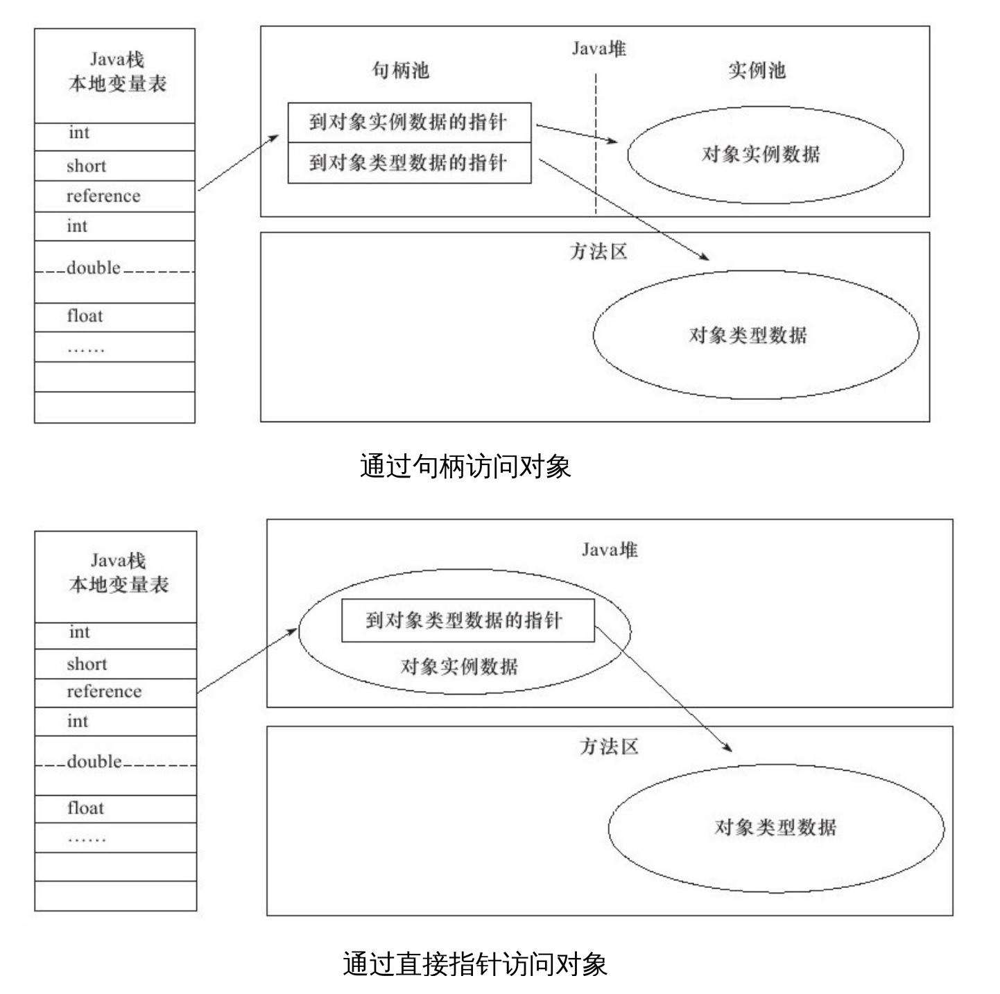
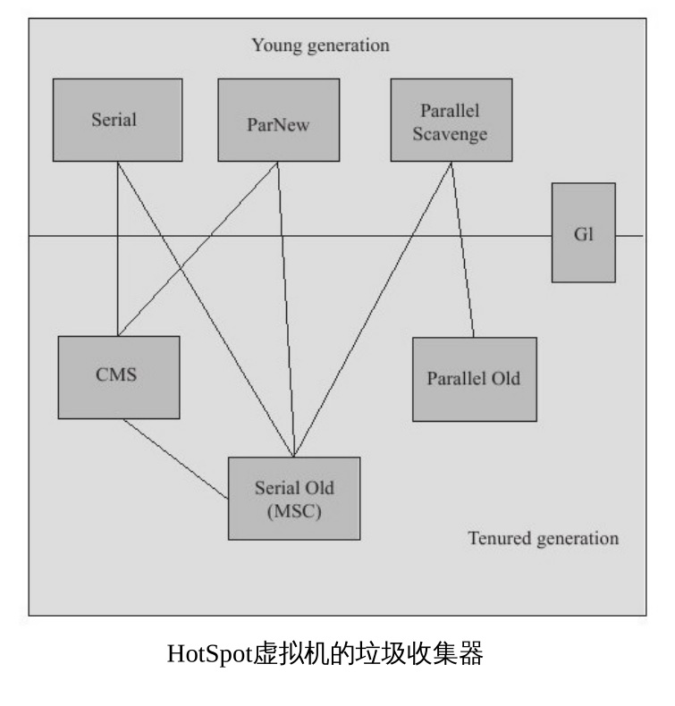
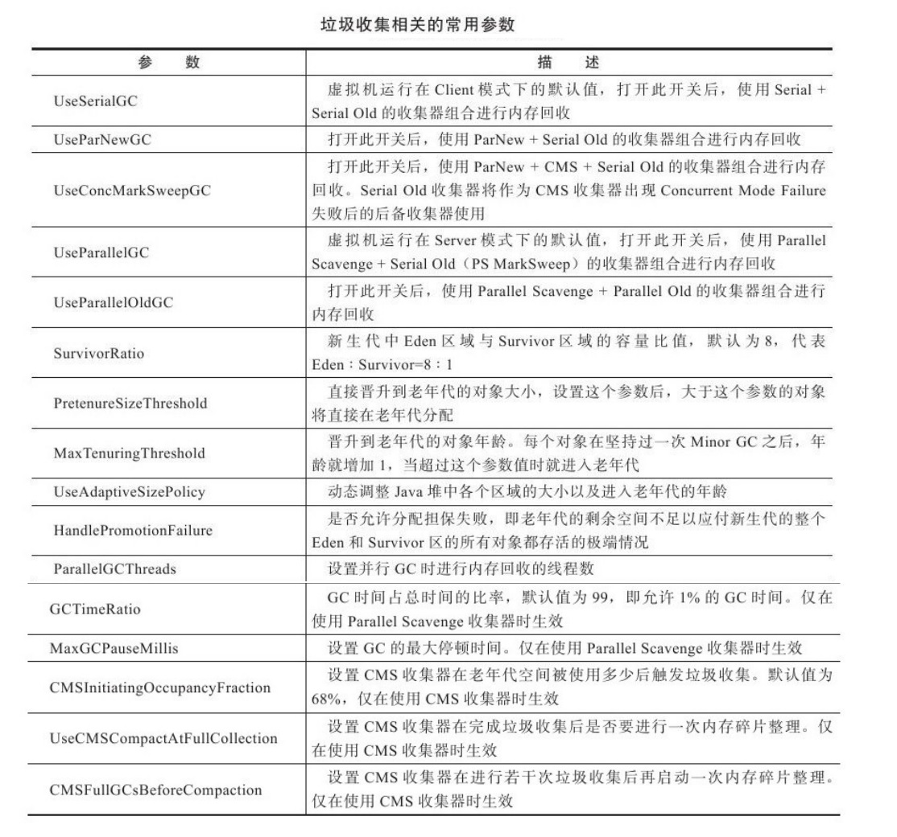
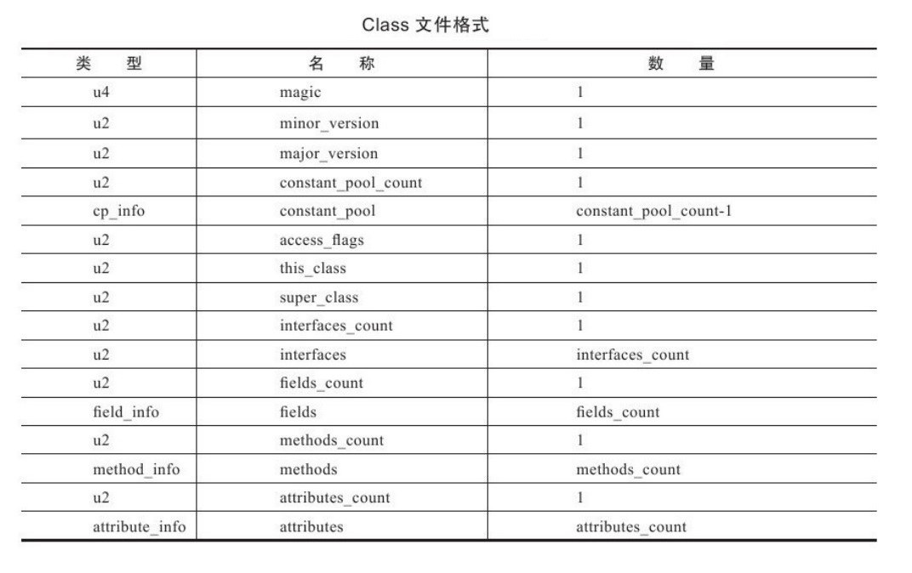
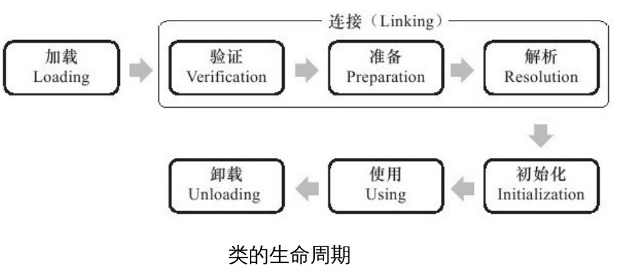

#### 《深入理解JVM虚拟机》

- 前言 

    JVM虚拟机在千差万别的物理机上建立了统一的运行平台，开发人员只需了解Java API、Java语法以及第三方框架
    即可，因此虚拟机的运作并不是一般开发人员必须掌握的知识。
    
- 第一章 走进Java

    广义上，Clojure、JRuby、Groovy等运行于虚拟机上的语言也属于Java技术体系的一员。
    HotSpot VM是SunJDK和OpenJDK中所带的虚拟机，也是目前使用范围最广的虚拟机
    
- 第二章 Java内存区域与内存溢出异常

    C、C++的开发人员，在内存管理领域，对每一个对象拥有所有权，负责每个对象的生命开始
    到终结的维护责任。对于Java开发人员，由于虚拟机的自动内存管理机制，不再需要为每一个对象写
    delete/free代码，不容易出现内存泄漏和内存溢出问题。但由于把内存控制权让渡给了虚拟机，一旦出现
    内存溢出问题将很难排查错误。
    
    Java虚拟机在执行程序过程中，会把所管理的内存分为如下的不同数据区域。
    
    - 程序计数器
    
    程序计数器（Program Counter Register）是一块较小的内存空间，可以看作是当前线程所执行的字节码的行号指示器。
    每个线程都会有一个独立的程序计数器，因此这是以一个“线程私有”的内存，如果线程正在执行一个Java方法，这个计数器
    记录的是正在执行的虚拟机字节码指令的地址；如果正在执行naive方法，这个计数器则为空（Undefined）。此内存区域
    是唯一一个在Java虚拟机规范中没有规定任何OutOfMemoryError情况的区域。
    
    - 虚拟机栈
    
    Java虚拟机栈（Java Virtual Machine Stacks）也是“线程私有”的，它的生命周期与线程相同。虚拟机栈描述的是Java方法
    执行的内存模型，每个方法在执行的同时都会创建一个栈帧（Stack Frame）用于存储局部变量表、操作数栈、动态链接、方法出口等信息。
    每一个方法从调用直至执行完成，就对应着一个栈帧在虚拟机中从入栈到出栈的过程。
    
    Java虚拟机规范中对这个区域规定了两种异常状态，如果线程请求的栈深度大于虚拟机所允许的深度将抛出StackOverflowError；如果虚拟机栈
    可以动态扩展，但扩展时无法申请到足够的内存就会抛出OutOfMemoryError异常。
    
    - 本地方法栈
    
    本地方法栈（Native Method Stack）与虚拟机所发挥的作用是非常相似的，它们之间的区别不过是虚拟机栈为虚拟机执行Java方法服务，
    而本地方法栈为虚拟机执行本地方法服务。HotSpot甚至直接将本地方法栈和虚拟机栈合二为一。其也会抛出StackOverflowError和
    OutOfMemoryError。
    
    - Java堆
    
    Java堆（Java Heap）是Java虚拟机所管理的内存中最大的一块，Java堆是被所有线程共享的一块内存区域，在虚拟机启动时创建。此
    内存的唯一目的就是存放对象的实例，几乎所有对象的实例都在这里分配内存。Java虚拟机规范中的描述是：所有对象的实例以及
    数组都要在堆上分配，但随着JIT编译器的发展与逃逸分析技术逐渐成熟，该规范也渐渐变得不那么绝对。
    
    Java堆也是垃圾收集器管理的主要区域，因此很多时候也被称作“GC堆”（Garbage Collected Heap）。
    
    - 方法区
    
    方法区（Method Area）与Java堆一样，是各个线程共享的内存区域，它用于存储已被虚拟机加载的类信息、常量、静态变量
    、即时编译器编译后的代码等数据。它有一个别名叫Non-Heap（非堆），目的是与Java堆区分开来。根据虚拟机规范的规定，当方法区
    无法满足内存分配需求时，将抛出OutOfMemoryError异常。
    
    - 运行时常量池
    
    运行时常量池（Runtime Constant Pool）是方法区的一部分。Class文件中除了有类的版本、字段、方法、接口等描述信息外，还有
    一项信息是常量池（Constant Pool Table），用于存放预编译期生成的各种字面量和符号引用，这部分内容将在类加载后进入方法区的
    运行时常量池中存放。受方法区限制，当无法满足内存分配需求时，将抛出OutOfMemoryError异常。
    
    - 直接内存
    
    直接内存（Direct Memory）并不是虚拟机运行时数据区的一部分，也不是Java虚拟机规范中定义的内存区域。但这部分内存也被频繁的使用，也可能导致
    OutOfMemoryError出现。
    
    JDK1.4中引入了NIO类，一种基于通道与缓冲区的IO方式，它可以使用native函数库直接分配堆外内存，然后通过存储在Java堆中的
    DirectByteBuffer对象最为这块内存的引用进行操作。这样在一些场景中显著提高了性能，因为避免了在Java堆和Native堆中来回复制数据。
    
    接下来会讨论HotSpot虚拟机在Java堆中对象分配、布局和访问的全过程。

    - 对象的创建
    
    在语言层面，创建对象通常仅仅是一个new关键词，而在虚拟机中，当遇到一条new指令时，首先将去检查这个指令的参数
    是否能在常量池中定位到一个类的符号引用，并检查这个符号引用代表的类是否已被加载、解析和初始化过。如果没有会有一个类
    加载过程。
    
    类加载检查通过后，接下来虚拟机将为新生对象分配内存。对象所需的内存在类加载完成后便可以完全确定，为对象分配空间的任务
    等同于把一块确定大小的内存从Java堆中划分出来。如果堆内存中区域划分是规整的，只须把指针向空闲空间挪动一段与对象大小相等
    的距离，这种分配称为“指针碰撞”（Bump the Pointer）。
    
    如果Java堆内存并不规整，已使用和未使用的空闲内存相互交错，则虚拟机必须维护一个列表，记录那些内存块是空用的，然后从
    列表中找出足够大的一块空间分配给对象实例，并更新列表记录，这种分配方式称为“空闲列表”（Free List）。
    
    在划分可用空间时可能存在线程安全问题，解决方案有两种，虚拟机采用的是CAS加失败重试的方式。第二种是在堆内存中预先为
    每个线程分配一小块内存，称为本地线程分配缓冲（Thread Local Allocation Buffer，TLAB）。可以通过`-XX:+/-UseTLAB`参数来设定/
    
    接下来虚拟机会对对象进行必要的设置，例如这个对象是哪个类的实例、类的元数据信息、对象的哈希码、对象的GC分代年龄等信息。
    这些信息将存放在对象的对象头（Object Header）之中。此时从虚拟机的角度，一个对象已经产生了。
    
    在HotSpot虚拟机中，对象在内存中存储的布局可以分为3块：对象头（Header）、实例数据（Instance Data）和对齐填充（Padding）。
    
    建立对象是为了使用对象，我们需要通过栈上的reference数据来操作堆上的具体对象。而访问对象的方式有两种。句柄和直接
    指针。如果使用句柄访问，那么会在Java堆中划分一块内存作为句柄池，reference中存储的就是对象的句柄地址，而句柄包含了
    对象实例数据与类型数据各自的具体地址信息。如果是直接指针访问，那么Java堆对象布局中就必须考虑如何防止访问类型数据的相关信息。
        
    HotSpot使用的是直接指针，因为它节省了一次指针定位的时间开销，但在整个软件开发的范围来看，这种通过句柄访问的方式也是十分常见。
    
    - 实战
    
    Java堆内存溢出[HeapOOM.java](demo/src/HeapOOM.java),该程序会造成堆内存溢出并生成一个堆内存快照，此时就要分析是内存
    泄露还是内存溢出，如果是泄露对象是如何导致垃圾收集器无法自动回收它们。如果是内存溢出，则要检查
    虚拟机堆参数（-Xmx与-Xms）。
    
    [JavaVMStackSOF.java](demo/src/JavaVMStackSOF.java)，使用-Xss参数减少栈内存容量，最终会抛出StackOverflowError异常
    
    [RuntimeConstantPoolOOM.java](demo/src/RuntimeConstantPoolOOM.java),这段代码在JDK1.6及之前的版本中，由于
    常量池分配在永久代内，因此会抛出OutOfMomoryError:PermGen space。而在JDK1.7运行上就会一直进行下去。
    
    `-XX:MaxDirectMemorySize`直接内存默认与Java堆的最大值一样
    
- 第三章 垃圾收集器与内存分配策略

    垃圾收集（Garbage Collection，GC）的历史远比Java久远，1960年诞生的Lisp是第一门真正使用内存动态分配和垃圾收集
    技术的语言。当Lisp还在胚胎期时，人们就在思考GC需要完成的3件事情：
    
    哪些内存需要回收？什么时候回收？如何回收？
    
    经过半个世纪的发展，目前内存的动态分配与内存回收技术已经相当成熟。当垃圾收集称为系统达到更高并发量的瓶颈的
    时候，我们就需要对这些自动化的技术实施必要的监控和调节。程序计数器、虚拟机栈、本地方法栈三个区域是
    随线程而生，随线程而灭，这几个区域的内存分配和回收具备确定性，因此不需要过多考虑回收的问题。
    
    而Java堆和方法区则不一样，一个接口的不同实现类、一个方法的多个分支需要的内存都不相同，我们只有在程序处于运行中
    才能知道需要创建哪些对象，这部分内存的分配和回收都是动态的，垃圾收集器关注的是这部分内存，后续讨论的内存也仅指
    这一部分内存。
    
    Java堆中存放着几乎所有的对象实例，哪些对象还存活着，哪些已经死去？
    - 引用计数算法
    
    给对象添加一个引用计数器，当有引用指向它时则加1，当引用失效时减去1，当计数器为0时，则这个对象就是不可能再被
    使用的了。该算法实现简单，判断效率高，但存在一个问题，当两个对象互相引用，则引用计数器不会为0，则无法通知GC回收它们。
    [ReferenceCountingGC.java](demo/src/ReferenceCountingGC.java)
    
    - 可达性分析算法
    
    Java、C#都是通过可达性分析来判断对象是否是存活的，这个算法的基本思路就是通过一系列的称为“GC Roots”的对象作为
    起始点，从这些节点开始向下搜索，搜索走过的路径称为引用链（Reference Chain），当一个对象到GC Roots没有任何引用链
    相连（用图论的话说，就是从GC Roots到这个对象不可达）时，则此对象是不可用的。
    
    在Java中，作为GC Roots的对象包括下面几种：虚拟机栈中引用的对象、方法区中类静态属性引用的对象、方法区中常量引用的对象，本地方法栈中
    native方法引用的对象。
    
    无论是哪种算法，判断对象是否存活都与“引用”有关，JDK1.2之前，内存只有引用和没有被引用两种状态，JDK1.2之后，Java
    对引用的概念进行了扩展，将引用分为强引用（Strong Refernce）、软引用（Soft Reference）、弱引用（Weak Reference）和
    虚引用（Phantom Reference），引用的强度依次逐渐衰减。
    
    强引用类似`Object obj = new Object()`这类，只要强引用存在，对象永远不会被回收。
    软引用是用来描述一些还有用但非必须的对象。在JDK1.2之后，提供了SoftReference类来实现弱引用。
    弱引用是用来描述一些还有用但非必须的对象。在JDK1.2之后，提供了WeakReference类来实现弱引用。
    虚引用是最弱的一种引用关系。在JDK1.2之后，提供了PhantomReference类来实现弱引用。
    
    - 垃圾收集算法
    
    因为各个虚拟机具体实现不同，此处只是介绍几种算法的思想。
    
    1. 标记-清除算法（Mark-Sweep）
    
        分为标记和清除两个阶段，首先标记所有需要回收的对象，在标记完成后统一回收所有被标记的对象。后续的
        所有算法都是基于这种思路进行改进得到的。他的主要不足有两个：一是效率问题，另一个是空间问题，清除
        过后会产生大量不连续的内存碎片。
    
    2. 复制算法
    
        为了解决效率问题，一种称为“复制”的算法出现了，它将可用内存按容量分为大小相等两块，每次使用其中一块，
        当这一块内存用完就将还活着的对象复制到另一块上面，然后再把已使用过的内容一次清理掉。这样使得每次都是对整个
        半区的内存进行内存回收，这种算法的代价是可用内存缩小为了原来的一半，代价未免太高了。
        
    3. 标记-整理算法
    
        标记过程仍然与“标记-清除”算法一样，但后续步骤不是直接对可回收对象进行清理，而是让所有存活的
        对象都向一端移动，然后直接清理掉端边界以外的内存。
        
    4. 分代收集算法
    
        当前商业虚拟机的垃圾收集都采用“分代收集”（Generation Collection）算法。这种算法把对象存活
        周期的不同将内存划分为几块。一般是把Java堆分为新生代和老年代，这样可以根据各个年代的特点采用
        最适当的收集算法。在新生代中，每次垃圾收集都会有大批对象死去，只有少量存活，这是就选用复制算法，只需
        付出少量存活对象的成本就可以完成收集。老年代中因为对象存活率高，就可以使用标记清理或标记整理算法。

    
    接下来会重点介绍CMS和G1两种相对复杂的收集器。
    
    - Serial收集器，历史最悠久，运行时会挂起其他所有工作线程。
    - ParNew收集器：Serial收集器的多线程版本。
    - Parallel Scavenge收集器，新生代的收集器，使用复制算法，并行的多线程收集器。该收集器可以精确
    控制吞吐量
    - Serial Old收集器，负责收集老年代的Serial版本
    - Parallel Old收集器，负责收集老年代的Parallel Scavenge版本。
    - CMS收集器（Concurrent Mark Sweep）是一种以获取最短回收停顿为目标的收集器。目前很大
    一部分的Java应用集中在B/S服务端上，这类应用重视服务的响应速度，希望停顿时间最短，该收集器
    非常符合这个需求。CMS是基于标记清除方法，他的过程包括 1.初始标记，2.并发标记，3.重新标记，4.并发清除
    
    1，2仍需Stop The World，而最耗时的并发标记和并发清除过程可以与用户线程一起工作。
    - G1收集器，当今收集器技术发展的最前沿成果之一，其运作大致可分为 1.初始标记 2.并发标记 3最终标记， 4. 筛选回收
    
    
    
    - 内存分配与回收策略
    
    对象的内存分配，往大方向上说，就是堆上分配，对象主要分配在新生代的Eden上，如果启动了本地线程
    分配缓冲，将按线程优先在TLAB上分配，少数情况下会直接分配到老年代中。
    - 对象有现在Eden中分配
    - 大对象直接进入老年代
    - 长期存活的对象将进入老年代，在新生代中美熬过一次MinorGC，年龄就增长一岁，默认15岁就会被分入
    老年代中，可以通过MaxTenuringThreshold来设定
    - 动态对象年龄判定
    
- 第四章 虚拟机性能监控与故障处理工具

    前两章对于虚拟机内存分配与回收技术的各方面进行了介绍，接下来将把这些知识应用到实际中。
    
    - JDK命令行工具
    
    在java的bin目录中有`java.exe`和`javac.exe`这两个命令行工具，而其他工具则并非所有人都了解，这些
    工具的大小基本稳定在27K左右，这些工具大多都是对jdk/lib/tools.jar类库的一层包装而已。
    
    - jps：虚拟机进程状况工具，列出正在运行的虚拟机进程，并显示虚拟机执行主类名称以及这些进程
    的本地虚拟机唯一ID（Local Virtual Machine Identifier，LVMID）。虽然功能单一，但是使用频率
    最高的JDK命令行工具。
    
    - jstat：虚拟机统计信息监视工具
    
    - jmap：Java内存映像工具
    
    - jhat：虚拟机堆转储快照分析工具，与jmap搭配使用，来分析jmap生成的堆转储快照，不过一般有更专业的
    工具可以使用
    
    - jstack：java堆栈跟踪工具，用于生成当前时刻的线程快照
    
- 第五章 调优案例分析与实战

    略
    
- 第六章 类文件结构

    Java虚拟机不和包括Java在内的任何语言绑定，它只与“Class文件”这种特定形式的二进制文件
    所关联，Class文件包含了Java虚拟机指令集和符号表以及若干其他辅助信息。Class文件是一组以
    8位字节为基础单位的二进制流，各个数据项目严格按照顺序紧凑的排列在Class文件之中，中间没有添加
    任何分割符。
    
    Class文件格式采用一种类似于C语言结构体的伪结构来存储数据，这种伪结构中只有两种数据类型：无符号数
    和表。
    
    无符号数属于基本的数据类型，以u1、u2、u4、u8来分别代表1个字节，2个字节，4个字节和8个字节的无符号数，
    无符号数用来描述数字、索引、数量值或者UTF-8编码构成的字符串值。
    
    表是偶多个无符号数或其他表作为数据项构成的复合数据类型，所有表都习惯以“_info”结尾。表用于描述有层次
    关系的复合结构的数据，整个Class文件本质上就是一张表。
    
    
    - 魔数与Class文件的版本
    
    每个Class文件的头4个字节称为魔数（Magic Number），它的唯一作用是确定这个文件是否为一个能被虚拟机接受
    的Class文件，选用魔数而不是扩展名作为标识主要是基于安全考虑，Class文件的魔数是“0xCAFEBABE”。紧接着的
    5，6字节是次版本号，7，8字节是主版本号。高版本的JDK能向下兼容，而高版本的则拒绝执行超过其版本号的Class文件。
    
    - 常量池
    
    紧接着主次版本号之后的是常量池入口，常量池可以理解为Class文件中的资源仓库，它是Class文件结构中与其他
    项目关联最多的数据类型，也是占用Class文件空间最大的数据项目之一。由于其大小不固定，所以在常量池入口需要
    防止一项u2来表式常量池容量计数。
    
    - 访问标志
    
    用于标志一些类或者接口层次的信息，包括类还是接口，abstract或是final，public或private等。
    
    - 类索引、父类索引与接口索引集合
    
    Class由这三项数据来确定这个类的继承关系。
    
    - 字段表集合
    
    字段表用于描述接口或者类中声明的变量。
    
    - 属性表集合
    
      ，，，，，，
      
    字节码按照操作用途大致分为9类，接下来概略的介绍以下这些指令的用法，详细信息可以参考Java虚拟机规范。
    - 加载和存储指令
    
    用于将数据在栈帧中的局部变量表和操作数栈之间来回传输
    
    - 运算指令
    
    用于对两个操作数栈上的只进行某种特定运算，并把结果重新存入操作栈顶
    
    - 类型转换指令
    
    将两种不同的数值类型进行互相转换，这些转换一般用于实现用户代码中的显式类型转换操作，或者用来处理
    本节开篇所提到的字节码指令集中数据类型相关的指令无法与数据类型一一对应的问题。
    
    - 对象创建与访问指令
    
    虽然类实例和数组都是对象，但是虚拟机对类实例和数组的创建与操作使用了不同的字节码指令。
    
    - 操作数栈管理指令
    
    如同操作数一个普通数据结构中的堆栈那样，Java虚拟机提供了一些直接操作操作数栈的指令。
    
    - 控制转移指令
    
    可以让Java虚拟机有条件或无条件地从指定地未知指令而不是控制转移指令地下一条指令继续执行程序。
    
    - 方法调用和返回指令
    
    - 异常处理指令
    
    Java显式抛出异常都由athrow指令来实现
    
    - 同步指令
    
    Java虚拟机可以支持方法级地同步和方法被不一段指令序列地同步
    
- 第七章 虚拟机类加载机制

    虚拟机把描述类的数据从CLass文件加载到内存，并对数据进行校验、转换解析和初始化，最终形成
    可以被虚拟机直接使用的Java类型，这就是虚拟机的类加载机制。
    
    类从加载到虚拟机内存中开始，到卸载出内存为止，它的整个生命周期包括：加载（Loading）、验证（Verification）、
    准备（Preparation）、解析（Resolution）、初始化（Initialization）、使用（Using）和卸载（Unloading）7个阶段。
    其中验证、准备、解析三个部分统称为连接（Linking）。
        
    
    - 类的加载过程
    
    1. 加载 在这一过程，虚拟机需要完成3件事情，1，通过一个类的全限定名来获取此类的二进制字节流；2.将这个
    字节流所代表的静态存储结构转化为方法区的运行时数据结构，3.在内存中生成一个代表这个类的java.lang.Class对象，
    作为方法区这个类的各种数据的访问入口
    
    2. 验证 是连接阶段的第一步，验证阶段十分重要，决定了Java虚拟机是否能够承受恶意代码的攻击，从
    执行性能的角度上，验证工作量在虚拟机的类加载子系统。虚拟机规范对这个阶段的限制和知道比较笼统，大致
    包含Class文件格式验证，元数据验证，字节码验证，符号引用验证。
    
    3. 准备 准备阶段是正式为类变量分配内存并设置类变量初始值的阶段。
    
    4. 解析 是虚拟机将常量池内的符号引用替换为直接引用的过程
    
    5. 初始化 是类加载过程的最后一步，该阶段才真正开始执行类中定义的Java程序代码。
    
    从Java开发人员角度看，类加载器大部分属于以下3中系统
    
    - 启动类加载器（Bootstrap ClassLoader），负责将java_home/lib目录中的被虚拟机识别的类库加载到
    虚拟机内存中。启动类加载器无法被Java程序直接引用
    
    - 扩展类加载器（Extension ClassLoader） 这个加载器由sun.misc.Launcher$ExtClassLoader实现，开发者可以
    直接使用扩展类加载器。
    
    - 应用程序类加载器（Application ClassLoader）：这个类加载器由sun.misc.Launcher$App-ClassLoader实现。
    它负责加载用户类路径（ClassPath）上所指定的类库，开发者可以直接使用这个类加载器。
    
    双亲委派模型是指所有类加载器都会把类的加载交给父类加载器，最终会传送到顶层的启动类加载器，该加载器无法完成加载
    再反馈请求交由子加载器尝试加载。因此诸如java.lang.Object，交由任何加载器加载最后出现在环境中的
    都是相同的类。
        

    
    
    
    
       