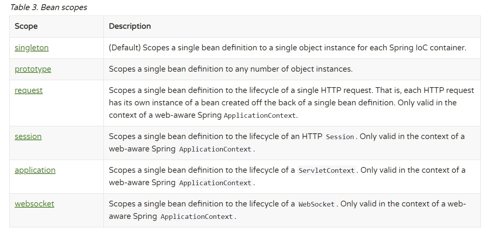

1. IoC 容器

    `org.springframework.beans`和`org.springframework.context`是Spring IoC容器的基础。
    BeanFactory接口提供了基于配置的管理任意Object的能力，ApplicationContext是BeanFactory的
    一个子接口，它能更好的与Spring AOP整合。总的来说BeanFactory提供了基于配置的框架而ApplicationContext
    更面向企业。
    
    Spring中这些组成你业务骨架的实体类被称为bean，`org.springframework.context.ApplicationContext`接口
    代表了IoC容器来初始化、装配和管理bean。这些配置信息的元数据可以是XML、Java注解或是Java代码。它有诸如
    `ClassPathXmlApplicationContext`和` FileSystemXmlApplicationContext`这样的实现类，XML是传统的定义方式，
    你也可以写少量的XML配置来让Spring通过Java注解和Java代码来装配bean。 Spring2.5开始支持注解，Spring3.0
    开始支持Java代码。
    ```
    ApplicationContext context = new ClassPathXmlApplicationContext("services.xml", "daos.xml");
    
    <?xml version="1.0" encoding="UTF-8"?>
    <beans xmlns="http://www.springframework.org/schema/beans"
        xmlns:xsi="http://www.w3.org/2001/XMLSchema-instance"
        xsi:schemaLocation="http://www.springframework.org/schema/beans
            https://www.springframework.org/schema/beans/spring-beans.xsd">
            
        <bean id="..." class="...">   
            <!-- collaborators and configuration for this bean go here -->
        </bean>
        
        <bean id="..." class="...">
            <!-- collaborators and configuration for this bean go here -->
        </bean>
        <!-- more bean definitions go here -->
    </beans>
    ```
    
    容器根据配置信息来组织bean,而bean的定义在容器内由BeanDefinition这个类来代表，这个类中包含了如下的
    属性：
    ```
    Class                       Instantiating Beans
    Name                        Naming Beans
    Scope                       Bean Scopes
    Constructor arguments       Dependency Injection
    Properties Dependency       Injection
    Autowiring mode             Autowiring Collaborators
    Lazy initialization mode    Lazy-initialized Beans
    Initialization method       Initialization Callbacks
    Destruction method          Destruction Callbacks
    ```
    对于不是由容器实例化（开发者手动实例化）的Object，如果需要交由容器管理，可以通过ApplicationContext的getBeanFactory()方法
    获得`DefaultListableBeanFactory`，然后通过`registerSingleton(..)`方法实现。但是一个典型的应用还是应该交由容器来实现类的实例。
    
    一个bean在其所在的容器内必须有一个唯一标识符，在XML配置中，你可以用id或者name属性，或者两者借用来指定唯一的
    一个bean，如果你不提供容器会为你生成一个唯一的标识。大部分情况不提供name的原因是inner bean
    ```
    <bean id="outer" class="...">
        <!-- instead of using a reference to a target bean, simply define the target bean inline -->
        <property name="target">
            <bean class="com.example.Person"> <!-- this is the inner bean -->
                <property name="name" value="Fiona Apple"/>
                <property name="age" value="25"/>
            </bean>
        </property>
    </bean>
    ```
    Spring支持别名
    ```
        <bean id="helloService" class="com.zjc.services.HelloService" >
        </bean>
        <alias name="helloService" alias="firstService"/>
        <alias name="helloService" alias="demoService"/>
    ```
    
    Bean的实例化默认是通过构造器，你也可通过静态的工厂方法
    ```
    <bean id="clientService"  class="examples.ClientService" factory-method="createInstance"/>
    
    public class ClientService {
        private static ClientService clientService = new ClientService();
        private ClientService() {}
        public static ClientService createInstance() {
            return clientService;
        }
    }
    ```
   你也可以通过静态工厂方法来实现
   ```
    <!-- the factory bean, which contains a method called createInstance() -->
    <bean id="serviceLocator" class="examples.DefaultServiceLocator">
        <!-- inject any dependencies required by this locator bean -->
    </bean>
    
    <!-- the bean to be created via the factory bean -->
    <bean id="clientService"
        factory-bean="serviceLocator"
        factory-method="createClientServiceInstance"/>
        
    <bean id="accountService"
        factory-bean="serviceLocator"
        factory-method="createAccountServiceInstance"/>
        
    public class DefaultServiceLocator {
        private static ClientService clientService = new ClientServiceImpl();
        
        public ClientService createClientServiceInstance() {
            return clientService;
        }
        public AccountService createAccountServiceInstance() {
            return accountService;
        }
    }
   ``` 
   依赖注入有两种形式，通过构造器或是setter方法，Spring团队推荐构造器注入。
   
   默认的容器会在启动时初始化所有单例的bean，当你手动指定lazy-init属性为true时，则这个初始化
  过程会被延迟到这个bean第一次被需要时。但是当你的懒加载bean被别的单例bean所依赖时，他就回立即初始化。
  你可以从容器层面来实现懒加载
  ```
   <beans default-lazy-init="true">
       <!-- no beans will be pre-instantiated... -->
   </beans>
  ```
  在Spring的诸多应用场景中bean都是单例形式，当一个单例bean需要和一个非单例bean组合使用或者
  一个非单例bean和另一个非单例bean组合使用时，我们通常都是将依赖以属性的方式放到bean中来引用，
  然后以@Autowired来标记需要注入的属性。但是这种方式在bean的生命周期不同时将会出现很明显的问题，
  假设单例bean A需要一个非单例bean B（原型），我们在A中注入bean B，每次调用bean A中的方法时都会
  用到bean B，我们知道Spring Ioc容器只在容器初始化时执行一次，也就是bean A中的依赖bean B只有一次
  注入的机会，但是实际上bean B我们需要的是每次调用方法时都获取一个新的对象（原型）所以问题明显就是：
  我们需要bean B是一个原型bean，而事实上bean B的依赖只注入了一次变成了事实上的单例bean。
  
  解决方法有两种，Bean A继承`ApplicationContextAware`,来获得ApplicationContext，依赖Bean b的时候通过
  getBean的方法手动获取，二是通过@Lookup注解
  ```
  <bean id="myCommand" class="fiona.apple.AsyncCommand" scope="prototype">
      <!-- inject dependencies here as required -->
  </bean>
  
  <!-- commandProcessor uses statefulCommandHelper -->
  <bean id="commandManager" class="fiona.apple.CommandManager">
      <lookup-method name="createCommand" bean="myCommand"/>
  </bean>

    public abstract class CommandManager {
        public Object process(Object commandState) {
            Command command = createCommand();
            command.setState(commandState);
            return command.execute();
        }

        @Lookup("myCommand")
        protected abstract Command createCommand();
    }
  ```
  
  Spring框架提供了六种Bean的Scope类型
  
  
  - Singleton Scope
    一个容器中只有一个bean的实例
  - Prototype Scope
  
    当通过getBean方法或是被别的bean依赖时，都会实例化一个新的bean
    
  - Request、Session、Application和WebSocket Scopes
  
    只在web-aware的ApplicationContext才能生效，在普通的容器中会引发IllegalStateException。
    
    当你在一个长生命周期的Bean中依赖了一个短生命周期的Bean，
    ```
    <bean id="userPreferences" class="com.something.UserPreferences" scope="session">
        <aop:scoped-proxy/>
    </bean>
    
    <bean id="userManager" class="com.something.UserManager">
        <property name="userPreferences" ref="userPreferences"/>
    </bean>
    ```
    通过 `<aop:scoped-proxy/>`元素，userManager操作代理对象，代理对象去session域中获取真正的对象方法调用。
    当你需要实现自己的Scope类型是你可以重写`org.springframework.beans.factory.config.Scope`来实现。
    
    Spring提供了若干接口来帮助你定制Bean的生命周期事件，可以通过`org.springframework.beans.factory.InitializingBean`
    或是`@PostConstruct`（JSR-250）注解来，推荐使用注解方式。
 
   Bean Definitoin中记录了Bean很多的相关配置信息，包括构造器参数、属性、初始化方法、静态工厂方法等，
   如果我们让一个子Bean类继承父Bean，就可以节省不少配置，子类配置由ChildBeanDefinition类代表，当时用
   XML配置时可以这样实现
   ```
    <bean id="inheritedTestBean" abstract="true"
            class="org.springframework.beans.TestBean">
        <property name="name" value="parent"/>
        <property name="age" value="1"/>
    </bean>
    
    <bean id="inheritsWithDifferentClass"
            class="org.springframework.beans.DerivedTestBean"
            parent="inheritedTestBean" init-method="initialize">  
        <property name="name" value="override"/>
        <!-- the age property value of 1 will be inherited from parent -->
    </bean>
   ```
   手动指定parent。
   
   Spring也提供了基于注解的配置，需要在xml中添加`<context:annotaion-config />`，注意它
   只会查找当前当前容器内bean上的注解，诸如`@Autowired`，JSR-330的`@Inject`有相同功能，
   该xml元素实际作用就是显式的向容器中注册AutowiredAnnotationBeanPostProcessor，CommonAnnotationBeanPostProcessor
    ，PersistenceAnnotationBeanPostProcessor，RequiredAnnotationBeanPostProcessor这四个Processor来处理注解
    
  你可以使用`@Autowired`来注入那些著名的接口诸如 BeanFactory, ApplicationContext, Environment, ResourceLoader,
   ApplicationEventPublisher和MessageSource。 因为该接口是基于Type类型来导入，因此一个接口可能存在多个可能的实现，
   这时就需要通过`@Primary`或`@Qualifier`注解来指定具体的实现。 Spring也支持JSR-250的注解`@Resource`来注入。
   
   之前的例子还是需要在XML中手动定义bean，而是把注入的工作交给了注解，接下来我们也将无需再XML中定义
   bean，而是也交给注解来完成，如`@Component`,`@Repository`, `@Service`,和`@Controller`。
   
   在XML中需要添加元素`<context:component-scan base-package="com.zjc"/>`，该注解会隐式的启用
   `<context:annotation-config>`。该元素内可以配置include-filter 和 exclude-filter，支持包括
   注解、切面、正则等多种规则来过滤。实现自己的BeanNameGenerator接口可以定义自己的默认命名bean
   的方式。
   ```
    <beans>
        <context:component-scan base-package="org.example">
            <context:include-filter type="regex" expression=".*Stub.*Repository"/>
            <context:exclude-filter type="annotation" expression="org.springframework.stereotype.Repository"/>
        </context:component-scan>
    </beans>
    
    ----------------------------
    <beans>
        <context:component-scan base-package="org.example"
            name-generator="org.example.MyNameGenerator" />
    </beans>
   ```
   如果需要指定Bean的scope类型可以添加`@Scope`注解，Spring3.0开始支持JSR-330的注解。
   @Autowired和@Inject，@Component和@Name，@Scope和@Singleton等。
   
   基于Java代码的配置，其核心使@Bean和@Configuration注解。
   
   

    
    
    
