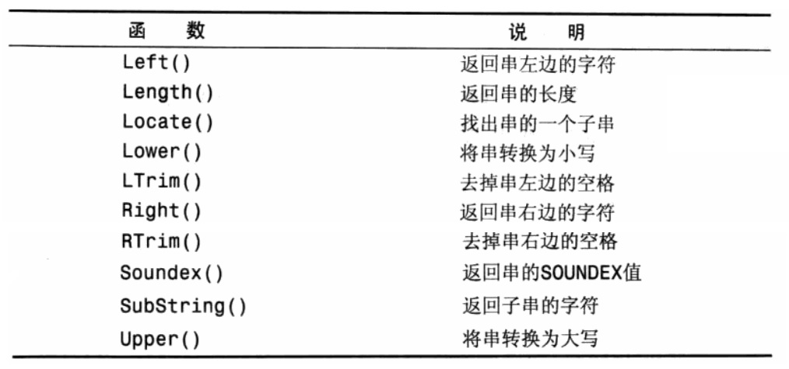
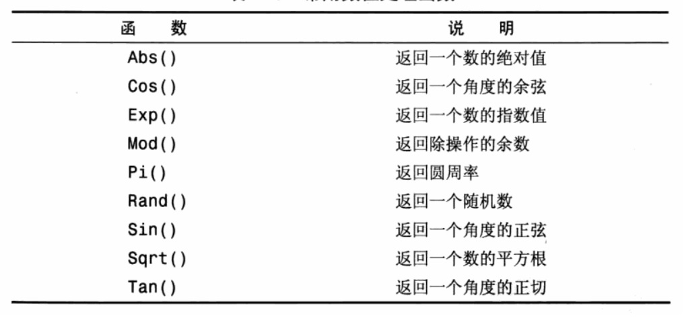

- 第1章 了解SQL

    - 数据库：保存有组织的数据的容器
    - 表|模式（schema）：某种特定数据类型的结构化清单
    - 列：表中的一个字段
    - 行：表中的一条记录
    - 主键（primary key）：能够唯一区分表中每一行的字段
    
- 第2章 MySQL简介

    MySQL是一种数据库管理系统，是一种基于客户机-服务器的数据库。服务器部分
    负责所有数据访问和处理的一个软件。这个软件运行在称为数据库服务器的计算机上。
    与数据库数据相关的添加、删除和数据更新的所有请求都由服务器软件完成。
    
    客户机是与用户打交道的软件。负责与服务器通信。服务器和客户机可能安装在两台计算机
    或同一台计算机上。
    
- 第3章 使用MySQL

   ```
    SHOW DATABASES;
    SHOW TABLES;
    SHOW COLUMNS FROM customers; | DESCRIBE customers;
    SHOW STATUS; --显示广泛的服务器状态信息
    SHOW CREATE TABLE customers; --展示建表语句，同样还可以用于DATABASE、FUNCTIONS、PROCDURE等
    SHOW GRANTS;--显示授予用户的安全权限
    SHOW ERRORS; | SHOW WARNINGS;--用来显示服务器错误或警告信息
   ```
   
- 第4章 检索数据

   ```
    SELECT prod_name FROM products;
    SELECT prod_id,prod_name,prod_price FROM products;
    SELECT * FROM products;
    SELECT DISTINCT vend_id FROM products;
    SELECT prod_name FROM products LIMIT 5;
    SELECT prod_name FROM products LIMIT 5,5;#开始位置，要检索的行数
    SELECT products.prod_name FROM products;
   ``` 
- 第5章 排序检索数据
    ```
    SELECT prod_name FROM products ORDER BY prod_name;
    SELECT prod_id,prod_price,prod_name FROM products ORDER BY prod_price,prod_name;
    SELECT prod_id,prod_price,prod_name FROM products ORDER BY prod_price desc ;
    SELECT prod_price FROM products ORDER BY prod_price desc LIMIT 1; #找出最高价
    ```
    
- 第6章 过滤数据

    ```
    SELECT prod_name,prod_price FROM products WHERE prod_price=2.5;
    SELECT prod_name,prod_price FROM products WHERE prod_price<10;
    SELECT vend_id,prod_name FROM products WHERE vend_id <>1003;
    SELECT prod_name,prod_price FROM products WHERE prod_price BETWEEN 5 AND 10; # BETWEEN可用于数字和日期
    SELECT cust_id FROM customers WHERE cust_email IS NULL;
    ```
    
- 第7章 数据过滤
    ```
    SELECT prod_name,prod_price FROM products WHERE vend_id =1003 AND prod_price<=10;
    SELECT prod_name,prod_price FROM products WHERE vend_id =1003 OR vend_id = 1002;
    SELECT prod_name,prod_price FROM products WHERE vend_id IN (1002,1003);
    SELECT prod_name,prod_price FROM products WHERE vend_id NOT IN (1002,1003);
    ```
    
- 第8章 用通配符过滤

   ```
    SELECT prod_name,prod_price FROM products WHERE prod_name LIKE 'jet%';
    SELECT prod_name,prod_price FROM products WHERE prod_name LIKE 's%e';
    SELECT prod_name,prod_price FROM products WHERE prod_name LIKE '_ ton anvil';
   ```
   
- 第9章 用正则表达式进行搜索

    ```
    SELECT prod_name,prod_price FROM products WHERE prod_name REGEXP '1000';
    SELECT prod_name,prod_price FROM products WHERE prod_name REGEXP '1000|2000';
    SELECT prod_name,prod_price FROM products WHERE prod_name REGEXP '[123] ton';
    ```
    
- 第10章 创建计算字段
    
    数据库表中的数据一般不是应用程序所需要的格式，因此需要对字段进行处理
    - 拼接字段
    
        多数数据库使用`||`来实现拼接，但在MySQL中使用Concat()函数来实现，这一点要铭记于心。
        ```
        SELECT CONCAT(vend_name,'(',vend_country,')') FROM vendors ORDER BY vend_name;
        SELECT CONCAT(RTRIM(vend_name),'(',RTRIM(vend_country),')') FROM vendors ORDER BY vend_name;
        SELECT CONCAT(RTRIM(vend_name),'(',RTRIM(vend_country),')') AS vend_title FROM vendors ORDER BY vend_name;
        ```
    - 执行算数计算： MySQL执行对数字类型字段进行算数计算
    
- 第11章 使用数据处理函数
    
    DBMS支持通过函数处理数据，但是这样移植性会较差。
    
    - 文本处理函数： 
    
    
    其中SOUNDEX是按照发音进行模糊匹配的函数
    
    - 日期处理函数
    
    
    - 数值处理函数
    
    
- 第12章 汇总数据

    - 聚集函数
    
    
- 第13章 分组数据

    `select vend_id ,count(*) as num_prods from products group by vend_id;`
    
    GROUP子句可以包含任意数目的列。这使得可以对分组进行嵌套，提供更细致的控制。如果分组进行了嵌套，数据
    会在最后规定的分组上进行汇总。GROUP BY子句列出的所有列必须是索引列或是有效的表达式（不能是聚集函数）。如果
    在子句中使用的是表达式，则在select中也要用相同的表达式，而不能是别名。
    
    GROUP BY必须出现在WHERE 之后，ORDER BY之前。
    
    如果需要过滤某个分组，则需要使用HAVING关键字。WHERE过滤行，HAVING过滤分组。WHERE会在分组钱进行过滤，HAVING
    则是在数据分组之后过滤。
    `select cust_id,count(*) as orders from orders group by cust_id having orders>=2;`

    