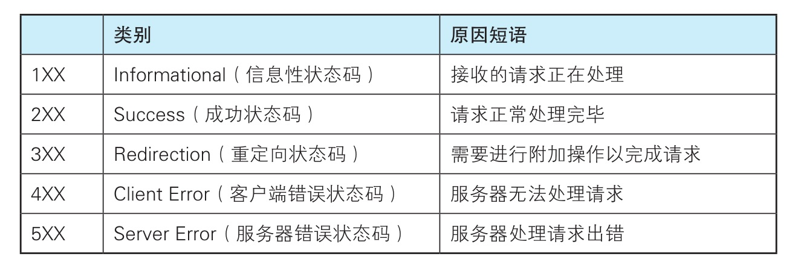
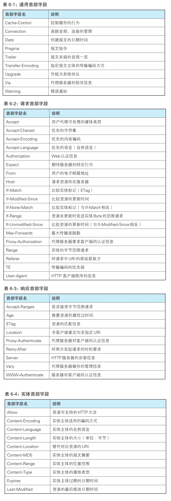

- 第1章 了解web及网络基础

    - 使用HTTP协议访问Web
    
    Web使用一种名为HTTP（HyperText Transfer Protocol）超文本传输协议作为规范，完成从客户端到服务端等一系列
    运作流程。可以说Web就是建立在HTTP协议上通信的。
    
    HTTP/1.0
    https://www.ietf.org/rfc/rfc1945.txt
    
    HTTP/1.1
    http://www.ietf.org/rfc/rfc2616.txt
    
    - 网络基础TCP/IP
    
        为了理解HTTP，我们必须先了解一下TCP/IP协议族。通常使用的互联网是在TCP/IP基础上运作的。
    而HTTP属于它内部的一个子集。
        计算机如果要相互通信，必须基于相同的方法，比如如何探测到通信目标，那一边先发起通信，怎么结束
    通信等。不同的硬件、操作系统之间的通信，所有的这一切都需要一种规则，我们把这种规则称为协议（protocol）。
        
        协议存在各种各样的内容，从电缆的规格到IP地址的选定方法、寻找异地用户的方法、双方建立通信的顺序，以及Web页面
    显示需要处理的步骤等等。我们把与互联网相关的协议结合总称为TCP/IP。
    
        - 应用层： FTP，DNS，HTTP
        - 传输层： TCP，UDP
        - 网络层： IP
        - 链路层
    - 与HTTP关系密切的协议：IP、TCP、DNS
    
        下面我们将针对与HTTP密不可分的这三个协议进行说明
        
        - 负责传输的IP协议
        
            IP（Internet Protocol）协议位于网络层，其作用主要是把各种数据包传送给对方。而要保证
         确实传送到对方哪里，则需要满足各种条件。其中两个重要的条件是IP地址和MAC地址。
         
            IP地址指明了节点被分配到的地址，MAC地址是网卡所属的固定地址。IP地址可以和MAC地址进行配对，
         IP地址可变换，而MAC地址基本不会更改。IP间的通信依赖MAC地址。在网络上，双方位于同一局域网的情况
         很少，通常是经过多台计算机和网络设备中转才能连接到对方。在进行中转时，会利用下站中转设备的
         MAC地址来搜索下一个中转目标。这时就会采用ARP（Address Resolution Protocol）协议。ARP协议是一种
         解析地址的协议，根据通信方的IP地址就能反查出对应的MAC地址。
         
        - 确保可靠性的TCP协议。
        
            TCP协议位于传输层，提供可靠的字节流服务。所谓的字节流服务（Byte Stream Service）是指，为了方便传输，
            将大块数据分割成以报文段（segment）为单位的数据包进行管理。而可靠，一言以蔽之，就是能够确认数据
            最终是否送达到对方。
            
            为了能将数据准确无误的送到目标出，TCP协议采用了三次握手策略（three-way handshaking）。用TCP协议把
            数据包送出去后，TCP协议不会对传送后的情况置之不理，他会向对方确认是否成功送达。握手过程中使用了
            TCP的标志---SYN（synchronize）和ACK（acknoledgement）。发送端首先发送一个带有SYN标志的数据包给对方，
            接收端收到后，回传一个带有SYN/ACK标志的数据包以示传达确认信息。最后，发送端再回传一个带ACK标志的数据包
            代表握手结束。
            
            如果再某个阶段莫名中断，TCP协议会再次以相同的顺序发送相同的数据包。
            
        - 负责域名解析的DNS服务
        
            DNS（Domain Name System）服务是和HTTP协议一样位于应用层的协议。它提供域名到IP地址之间的解析服务。
            用户通常是通过主机名或者域名来访问对方的计算机而不是IP地址。而计算机则更擅长处理数字，因此DNS服务
            应运而生。DNS服务提供通过域名查找IP地址，或是逆向从IP地址反查域名的服务
            
    - URI和URL
    
        相较URI（统一资源标识符），我们更熟悉的是URL（统一资源定位符）。URL正是使用浏览器访问Web页面所需
        输入的网页地址。URI用字符串标识某一互联网资源。而URL表示资源的地点。可见URL是URI的子集。
        
- 第2章 简单的HTTP协议

    - HTTP协议用于客户端和服务端之间的通信
    
        请求资源的一段称为客户端，提供资源响应的一段称为服务器端。HTTP协议规定，请求从客户端发出，最后
    服务端响应请求并返回。
    
    - HTTP是不保存状态的协议
        
        HTTP是一种不保存状态，即无状态协议。HTTP协议自身不对请求和响应之间的通信状态进行保存。每当发送新的请求时，就会有
        对应的新响应产生。协议本身并不保留之前一切的请求或响应的报文。这是为了更快的处理大量事务。为了能够实现期望的
        保持状态功能，于是引入了Cookie技术。有关Cookie的内容稍后进行讲解。
        
    - 请求URI定位资源
       
         HTTP协议使用URI定位互联网上的资源。
         
    - 告知服务器意图的HTTP方法
    
        - GET:获取资源
        
            用来请求访问已被URI识别的资源
        
        - POST：传输尸体主题
        
            虽然GET方法也可以传输实体的主体，但一般不用GET进行传输而使用POST方法。
        
        - PUT：传输文件
        
            就像FTP协议上传文件一样，要求在报文的主体中包含文件内容，然后保存到请求URI指定的未知。但是由于PUT方法
        本身不带验证机制。任何人都可以上传文件存在安全性问题。因此一般不使用该方法。如果配合Web应用程序的验证机制，
        或架构设计采用REST标准的同类Web网站，就可能会开放使用PUT方法。
        
        - HEAD：获得报文首部
        
            和GET方法一样，只是不返回报文主体部分。用于确认URI的有效性及资源更新的日期时间等。
        
        - DELETE：删除文件
        
            用来删除文件，是与PUT方法相反的方法，一般也不会开放使用。
          
        - OPTIONS：询问支持的方法
        
            用来查询针对请求URI指定的资源支持的方法
        
        - TRACE：追踪路径
        
            是让Web服务器端将之前的请求还会给客户端的方法。
            
        - CONNECT：要求用隧道协议连接代理
        
            CONNECT方法要求再代理服务器通信时建立隧道，实现用隧道协议进行TCP通信，主要使用
            SSL和TLS协议把通信内容进行加密。
            
    - 使用方法下达命令
    
        向请求URI指定的资源发送请求报文时，采用称为方法的命令
        
        
        
    - 持久链接节省通信量
    
        再HTTP协议初始版本中，每进行一次HTTP连接就要断开一次TCP连接。为了解决上述问题，在HTTP/1.1
        提出了持久链接的方法，只要任意一端没有明确提出断开连接，则保持TCP连接状态。
        
        持久链接使得多数请求以管线化（pipelining）方式发送成为可能。从前发送请求后需等待并收到响应才能
        发送下一个请求。管线化技术出现后，不用等待响应亦可直接发送下一个请求。这样就可以同时并行发送
        多个请求，而不需要一个接一个地等待了。
        
    - 使用Cookie的状态管理
    
        Cookie会根据服务器端发送的响应报文内的一个Set-Cookie的首部字段信息，通知客户端保存Cookie。当下次
    客户端再往该服务器发送请求时，客户端会自动在请求报文中加入Cookie值后发送出去。
        
        服务器端发现科幻段发送过来的Cookie后，会去检查究竟是从哪一个客户端发送过来的连接请求，然后对比
        服务器上的记录，最后得到之前的状态信息。   
        
- 第3章 HTTP报文内的HTTP信息

    - HTTP报文      
        用于协议交互的信息被称为HTTP报文。请求端的HTTP报文叫做请求报文，响应端的叫做响应报文。HTTP报文
        本身是由多行（用CR+LF换行符）数据构成的字符串文本。
        报文大致可以分为报文首部和报文主体两块。 
        
    - 编码提升传输速率
    
        HTTP在传输数据时可以按照数据原貌直接传输，也可以在传输过程中通过编码提升传输速率。通过在传输时
        编码，能有效的处理大量的访问请求。但是，编码的操作需要计算机来完成，因此会消耗更多的CPU资源。
        
        HTTP协议中有一种被称为内容编码的功能，允许对实体内容进行原样压缩，常用的压缩方式有gzip、compress、deflate、identity。
        
        在传输大容量数据时，通过把数据分割成多块，能够让浏览器逐步显示页面，这种把实体主体分块的功能称为分块传输编码（Chunked Transfer Coding）。
    - 发送多种数据的多部分对象集合
    
        发送邮件时，我们可以添加多份附件，这是因为采用了MIME（Multipurpose Internet Mail Extensions，多用途因特网邮件扩展）机制。
        它允许邮件处理文本、图片、视频等多个不同类型的数据。
    - 获取部分内容的范围请求
        
        以前当下载过程遇到中断那就必须冲头开始，为了解决上述问题，需要一种可恢复机制，即能从下载中断处回复下载。
        要实现该功能需要指定下载的实体范围。这种指定范围发送的请求叫做范围请求（Range Request）。对于一份10000字节的
        资源，如果使用范围请求，可以只请求5001-10000字节内的资源。
        ```
        GET /tip.jpg HTTP/1.1
        Host: www.usagidesign.jp
        Range: bytes =5001-10000
        
        HTTP/1.1 206 Partial Content
        Date: Fri, 13 Jul 2012 04:39:17 GMT
        Content-Range: bytes 5001-10000/10000
        Content-Length: 5000
        Content-Type: image/jpeg
        ```
        
    - 内容和协商返回最合适的内容
    
        同一个Web网站可能存在多分相同内容的页面，比如英语版和中文版的Web页面，尽管内容相同但语言却不相同，当浏览器
        设置为中文版，则会显示对应的中文版的Web页面，这种机制称为内容协商（Content Negotiation）。内容协商机制是指
        客户端和服务端就响应的资源内容进行交涉，然后提供给客户端最为合适的资源。内容协商会以响应资源的语言、字符集、编码方式
        等作为判断的基准。
        
        包含在请求报文首部的如下字段就是判断的基准：Accept、Accept-Charset、Accept-Encoding、Accept-Language、Content-Language。
        
        内容协商技术有以下三种类型。
        
        - 服务器驱动协商：由服务器进行内容协商，服务器根据首部字段为参考自动处理。
        - 客户端驱动协商：由客户端进行内容写上，用户从浏览器显示的可选列表中手动选择，还可以利用JavaScript脚本在
        Web页面上自动进行上述选择。
        - 透明协商：服务器驱动和客户端驱动的结合体。
        
- 第4章 返回结果的HTTP状态码

    HTTP状态吗负责表示客户端HTTP请求的返回结果、标记服务器端的处理是否正常、通知出现的错误等工作。
    
    - 状态码告知从服务器端返回的请求结果
    
       状态码的职责是当客户端向服务器端发送请求时，描述返回的请求结果。借助状态码，用户可以知道服务器端
       正确处理了请求，还是出现了错误
       
       
       
   - 2xx 成功
     - 200 OK
     - 204 No Content：服务器已成功处理，但在返回的响应报文中不包含实体的主体部分。
     - 206 Partial Content：响应报文中包含由Context-Range指定范围的实体内容
   - 3xx 重定向
    
        3xx响应结果表明浏览器需要执行某些特殊的处理以正确处理请求。
        
        - 301 Moved Permanently：请求的资源已被分配了新的URI，以后应使用资源现在所指的URI。
        - 302 Found：临时重定向。该状态码表示请求的资源已被分配了新的URI，和301相比，302状态码
        代表资源不是永久被移动，只是临时性质的。换句话说，已移动的资源对应的URI将来还有可能发生改变。
        - 303 See Other：303状态码和302Found状态码有着相同的功能，但303状态码明确表示客户端应当
        采用GET方法获取资源。
        
        当301、302、303响应状态码返回时，几乎所有的浏览器都会把POST给位GET，并删除请求报文的主体，再次发送请求。
        
        - 304 Not Modified：服务器端的资源未改变，可以直接使用客户端未过期的缓存。
        - 307 Temporary Redirect：临时重定向，不同于302，浏览器不会把POST改为GET再次发送请求。
        
    - 4xx 客户端错误
    
        4xx的响应结果表明客户端是发生错误的原因所在
        
        - 400 Bad Request:请求报文中存在语法错误
        - 401 Unauthorized：发送的请求需要由通过HTTP认证的认证信息。
        - 403 Forbidden：对资源的访问被服务器明确拒绝了。服务器没必要给出拒绝的详细理由。
        - 404 Not Found：服务器上无法找到请求的资源。
        
    - 5xx 服务器错误
    
        5xx的响应结果表明服务器本身发生错误
        
        - 500 Internal Server Error：服务器端在执行请求时发生了错误
        - 503 Service Unavailable：服务器暂时处于超负载或正在进行停机维护，现在无法处理请求。
        
- 第5章 与HTTP协作的Web服务器

    HTTP/1.1规范允许一台HTTP服务器搭建多个Web站点。
    
    - 通信数据转发程序：代理、网关、隧道
    
        HTTP通信时，除了客户端、服务器以外，还有一些嗯用于通信数据转发的应用程序，例如代理
        、网关和隧道。他们可以配合服务器工作。
        
        - 代理：一种有转发功能的应用程序，它扮演了位于服务器和客户端中间人的角色
        - 网关：接收从客户端发送来的请求时，它就像自己拥有资源的服务器一样对请求进行处理。
        - 隧道：隧道是在相隔甚远的客户端和服务器两者之间进行中转并保持双方通信连接的应用程序。
        
    - 保存资源的缓存
        
        缓存是指代理服务器或客户端本地磁盘内保存的资源副本。利用缓存可以减少对源服务器的访问，节省了
        通信流量和通信时间。缓存服务器是代理服务器的一种，并归类在缓存代理类型中。
        
        缓存在浏览器客户端称之为临时网络文件（Temporary Internet File）
        
- 第6章 HTTP首部

    HTTP协议的请求和响应报文中必定包含HTTP首部，只是我们在使用Web的过程中感受不到它。
    
    - HTTP报文首部
        
        HTTP协议的请求和响应报文中必须包含HTTP首部。首部内容为客户端和服务器分别处理请求和响应所需要的重要
    信息。对于客户端用户来说。这些信息大部分无需亲自查看。报文首部由几个字段构成。
    
        - HTTP请求报文首部
        
        包含方法、URI、HTTP版本 HTTP首部字段等部分
        ```
        GET / HTTP/1.1
        Host: hackr.jp
        User-Agent: Mozilla/5.0 (Windows NT 6.1; WOW64; rv:13.0) Gecko/
        20100101 Firefox/13.0
        Accept: text/html,application/xhtml+xml,application/xml;q=0.9,
        */*; q=0.8
        Accept-Language: ja,en-us;q=0.7,en;q=0.3
        Accept-Encoding: gzip, deflate
        DNT: 1
        Connection: keep-alive
        If-Modified-Since: Fri, 31 Aug 2007 02:02:20 GMT
        If-None-Match: "45bae1-16a-46d776ac"
        Cache-Control: max-age=0
        ```
        
        - HTTP响应报文
        
        包含HTTP版本、状态码、HTTP首部字段3部分组成
        ```
        HTTP/1.1 304 Not Modified
        Date: Thu, 07 Jun 2012 07:21:36 GMT
        Server: Apache
        Connection: close
        Etag: "45bae1-16a-46d776ac"
        ```
        
    - HTTP首部字段
    
        HTTP首部字段是构成HTTP报文的要素之一，无论是请求还是响应，都会使用首部字段，他能起到传递额外信息
        的重要作用。使用首部字段是为了给浏览器和服务器提供报文主体大小、所使用的语言、认证信息等。
        
        - 首部字段一览
        
        
        
- 第7章 确保Web安全的HTTPS

    在HTTP协议中可能存在信息窃听或身份伪装等安全问题。使用HTTPS通信机制可以有效阻止这些问题。
    
    - HTTP的缺点
    
        通信使用明文（未加密），存在被窃听的风险。不验证通信方的身份，因此有可能遭遇伪装。无法证明
        报文的完整性，所以有可能已遭篡改。不仅仅是HTTP协议，其他未加密的协议中也存在这类问题。
        
        HTTP没有加密机制，但可以通过和SSL（Secure Socket Layer，安全套接字）或TLS（Transport Layer Security，安全
        传输协议）组合使用，加密HTTP的通信内容。这种与SSL组合的HTTP被称为HTTPS（HTTP secure，超文本传输安全协议）。
        
        服务器接收到一个URL请求，不论是谁发来的，都会返回响应，这种不确认通信方的方式，也会有各种隐患。
        
     - HTTP+加密+认证+完整性保护=HTTPS
     
        通常HTTP协议直接和TCP通信，当使用SSL时，则演变成先和SSL通信，再有SSL和TCP通信，不单单时HTTP，SMTP和Telnet
        等协议也可以配合使用SSL协议。
        
        SSL采用一种叫做公开密钥加密的加密处理方式。加密和解密都是使用一个密钥的方式称为共享密钥加密，也叫
        对称密钥加密。而公开密钥加密也叫非对称加密，发送密文的一方用对方的公开密钥进行加密处理，对方收到后
        用自己的私有密钥进行解密，利用这种方式，不需要发送用来解密的密钥，也不必担心密钥被攻击者窃听走。
        
- 第8章 确认访问用户身份的认证
    
      略
      
- 第9章 基于HTTP的功能追加协议

    - 使用浏览器进行全双工通信的WebSocket
    
        即Web浏览器与Web服务器之间全双工通信标准。
        
- 第10章 构建Web内容的技术

    - HTML
    
- 第11章 Web的攻击技术

    略

    
        
            
    
        
        

   