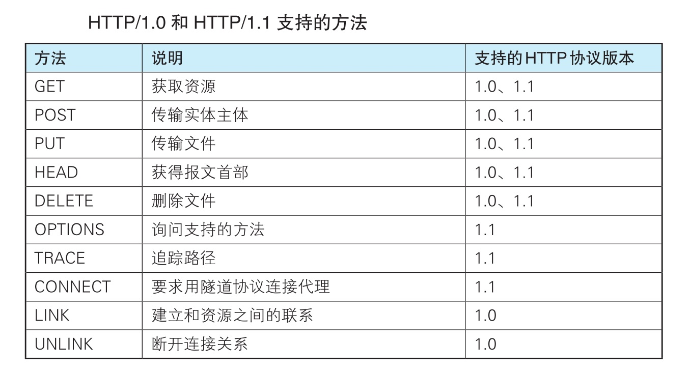

- 第1章 了解web及网络基础

    - 使用HTTP协议访问Web
    
    Web使用一种名为HTTP（HyperText Transfer Protocol）超文本传输协议作为规范，完成从客户端到服务端等一系列
    运作流程。可以说Web就是建立在HTTP协议上通信的。
    
    HTTP/1.0
    https://www.ietf.org/rfc/rfc1945.txt
    
    HTTP/1.1
    http://www.ietf.org/rfc/rfc2616.txt
    
    - 网络基础TCP/IP
    
        为了理解HTTP，我们必须先了解一下TCP/IP协议族。通常使用的互联网是在TCP/IP基础上运作的。
    而HTTP属于它内部的一个子集。
        计算机如果要相互通信，必须基于相同的方法，比如如何探测到通信目标，那一边先发起通信，怎么结束
    通信等。不同的硬件、操作系统之间的通信，所有的这一切都需要一种规则，我们把这种规则称为协议（protocol）。
        
        协议存在各种各样的内容，从电缆的规格到IP地址的选定方法、寻找异地用户的方法、双方建立通信的顺序，以及Web页面
    显示需要处理的步骤等等。我们把与互联网相关的协议结合总称为TCP/IP。
    
        - 应用层： FTP，DNS，HTTP
        - 传输层： TCP，UDP
        - 网络层： IP
        - 链路层
    - 与HTTP关系密切的协议：IP、TCP、DNS
    
        下面我们将针对与HTTP密不可分的这三个协议进行说明
        
        - 负责传输的IP协议
        
            IP（Internet Protocol）协议位于网络层，其作用主要是把各种数据包传送给对方。而要保证
         确实传送到对方哪里，则需要满足各种条件。其中两个重要的条件是IP地址和MAC地址。
         
            IP地址指明了节点被分配到的地址，MAC地址是网卡所属的固定地址。IP地址可以和MAC地址进行配对，
         IP地址可变换，而MAC地址基本不会更改。IP间的通信依赖MAC地址。在网络上，双方位于同一局域网的情况
         很少，通常是经过多台计算机和网络设备中转才能连接到对方。在进行中转时，会利用下站中转设备的
         MAC地址来搜索下一个中转目标。这时就会采用ARP（Address Resolution Protocol）协议。ARP协议是一种
         解析地址的协议，根据通信方的IP地址就能反查出对应的MAC地址。
         
        - 确保可靠性的TCP协议。
        
            TCP协议位于传输层，提供可靠的字节流服务。所谓的字节流服务（Byte Stream Service）是指，为了方便传输，
            将大块数据分割成以报文段（segment）为单位的数据包进行管理。而可靠，一言以蔽之，就是能够确认数据
            最终是否送达到对方。
            
            为了能将数据准确无误的送到目标出，TCP协议采用了三次握手策略（three-way handshaking）。用TCP协议把
            数据包送出去后，TCP协议不会对传送后的情况置之不理，他会向对方确认是否成功送达。握手过程中使用了
            TCP的标志---SYN（synchronize）和ACK（acknoledgement）。发送端首先发送一个带有SYN标志的数据包给对方，
            接收端收到后，回传一个带有SYN/ACK标志的数据包以示传达确认信息。最后，发送端再回传一个带ACK标志的数据包
            代表握手结束。
            
            如果再某个阶段莫名中断，TCP协议会再次以相同的顺序发送相同的数据包。
            
        - 负责域名解析的DNS服务
        
            DNS（Domain Name System）服务是和HTTP协议一样位于应用层的协议。它提供域名到IP地址之间的解析服务。
            用户通常是通过主机名或者域名来访问对方的计算机而不是IP地址。而计算机则更擅长处理数字，因此DNS服务
            应运而生。DNS服务提供通过域名查找IP地址，或是逆向从IP地址反查域名的服务
            
    - URI和URL
    
        相较URI（统一资源标识符），我们更熟悉的是URL（统一资源定位符）。URL正是使用浏览器访问Web页面所需
        输入的网页地址。URI用字符串标识某一互联网资源。而URL表示资源的地点。可见URL是URI的子集。
        
- 第2章 简单的HTTP协议

    - HTTP协议用于客户端和服务端之间的通信
    
        请求资源的一段称为客户端，提供资源响应的一段称为服务器端。HTTP协议规定，请求从客户端发出，最后
    服务端响应请求并返回。
    
    - HTTP是不保存状态的协议
        
        HTTP是一种不保存状态，即无状态协议。HTTP协议自身不对请求和响应之间的通信状态进行保存。每当发送新的请求时，就会有
        对应的新响应产生。协议本身并不保留之前一切的请求或响应的报文。这是为了更快的处理大量事务。为了能够实现期望的
        保持状态功能，于是引入了Cookie技术。有关Cookie的内容稍后进行讲解。
        
    - 请求URI定位资源
       
         HTTP协议使用URI定位互联网上的资源。
         
    - 告知服务器意图的HTTP方法
    
        - GET:获取资源
        
            用来请求访问已被URI识别的资源
        
        - POST：传输尸体主题
        
            虽然GET方法也可以传输实体的主体，但一般不用GET进行传输而使用POST方法。
        
        - PUT：传输文件
        
            就像FTP协议上传文件一样，要求在报文的主体中包含文件内容，然后保存到请求URI指定的未知。但是由于PUT方法
        本身不带验证机制。任何人都可以上传文件存在安全性问题。因此一般不使用该方法。如果配合Web应用程序的验证机制，
        或架构设计采用REST标准的同类Web网站，就可能会开放使用PUT方法。
        
        - HEAD：获得报文首部
        
            和GET方法一样，只是不返回报文主体部分。用于确认URI的有效性及资源更新的日期时间等。
        
        - DELETE：删除文件
        
            用来删除文件，是与PUT方法相反的方法，一般也不会开放使用。
          
        - OPTIONS：询问支持的方法
        
            用来查询针对请求URI指定的资源支持的方法
        
        - TRACE：追踪路径
        
            是让Web服务器端将之前的请求还会给客户端的方法。
            
        - CONNECT：要求用隧道协议连接代理
        
            CONNECT方法要求再代理服务器通信时建立隧道，实现用隧道协议进行TCP通信，主要使用
            SSL和TLS协议把通信内容进行加密。
            
    - 使用方法下达命令
    
        向请求URI指定的资源发送请求报文时，采用称为方法的命令
        
        
        
    - 持久链接节省通信量
    
        再HTTP协议初始版本中，每进行一次HTTP连接就要断开一次TCP连接。为了解决上述问题，在HTTP/1.1
        提出了持久链接的方法，只要任意一端没有明确提出断开连接，则保持TCP连接状态。
        
        持久链接使得多数请求以管线化（pipelining）方式发送成为可能。从前发送请求后需等待并收到响应才能
        发送下一个请求。管线化技术出现后，不用等待响应亦可直接发送下一个请求。这样就可以同时并行发送
        多个请求，而不需要一个接一个地等待了。
        
    - 使用Cookie的状态管理
    
        Cookie会根据服务器端发送的响应报文内的一个Set-Cookie的首部字段信息，通知客户端保存Cookie。当下次
    客户端再往该服务器发送请求时，客户端会自动在请求报文中加入Cookie值后发送出去。
        
        服务器端发现科幻段发送过来的Cookie后，会去检查究竟是从哪一个客户端发送过来的连接请求，然后对比
        服务器上的记录，最后得到之前的状态信息。   
        
- 第3章 HTTP报文内的HTTP信息

    - HTTP报文      
        用于协议交互的信息被称为HTTP报文。请求端的HTTP报文叫做请求报文，响应端的叫做响应报文。HTTP报文
        本身是由多行（用CR+LF换行符）数据构成的字符串文本。
        报文大致可以分为报文首部和报文主体两块。 
        
    - 编码提升传输速率
    
        HTTP在传输数据时可以按照数据原貌直接传输，也可以在传输过程中通过编码提升传输速率。通过在传输时
        编码，能有效的处理大量的访问请求。但是，编码的操作需要计算机来完成，因此会消耗更多的CPU资源。
        
        HTTP协议中有一种被称为内容编码的功能，允许对实体内容进行原样压缩，常用的压缩方式有gzip、compress、deflate、identity。
        
        在传输大容量数据时，通过把数据分割成多块，能够让浏览器逐步显示页面，这种把实体主体分块的功能称为分块传输编码（Chunked Transfer Coding）。
    - 发送多种数据的多部分对象集合
    
        发送邮件时，我们可以添加多份附件，这是因为采用了MIME（Multipurpose Internet Mail Extensions，多用途因特网邮件扩展）机制。
        它允许邮件处理文本、图片、视频等多个不同类型的数据。
    - 获取部分内容的范围请求
        
        以前当下载过程遇到中断那就必须冲头开始，为了解决上述问题，需要一种可恢复机制，即能从下载中断处回复下载。
        要实现该功能需要指定下载的实体范围。这种指定范围发送的请求叫做范围请求（Range Request）。对于一份10000字节的
        资源，如果使用范围请求，可以只请求5001-10000字节内的资源。
        ```
        GET /tip.jpg HTTP/1.1
        Host: www.usagidesign.jp
        Range: bytes =5001-10000
        
        HTTP/1.1 206 Partial Content
        Date: Fri, 13 Jul 2012 04:39:17 GMT
        Content-Range: bytes 5001-10000/10000
        Content-Length: 5000
        Content-Type: image/jpeg
        ```
        
    - 内容和协商返回最合适的内容
    
        同一个Web网站可能存在多分相同内容的页面，比如英语版和中文版的Web页面，尽管内容相同但语言却不相同，当浏览器
        设置为中文版，则会显示对应的中文版的Web页面，这种机制称为内容协商（Content Negotiation）。内容协商机制是指
        客户端和服务端就响应的资源内容进行交涉，然后提供给客户端最为合适的资源。内容协商会以响应资源的语言、字符集、编码方式
        等作为判断的基准。
        
        包含在请求报文首部的如下字段就是判断的基准：Accept、Accept-Charset、Accept-Encoding、Accept-Language、Content-Language。
        
        内容协商技术有以下三种类型。
        
        - 服务器驱动协商：由服务器进行内容协商，服务器根据首部字段为参考自动处理。
        - 客户端驱动协商：由客户端进行内容写上，用户从浏览器显示的可选列表中手动选择，还可以利用JavaScript脚本在
        Web页面上自动进行上述选择。
        - 透明协商：服务器驱动和客户端驱动的结合体。
        
            
    
        
        

   