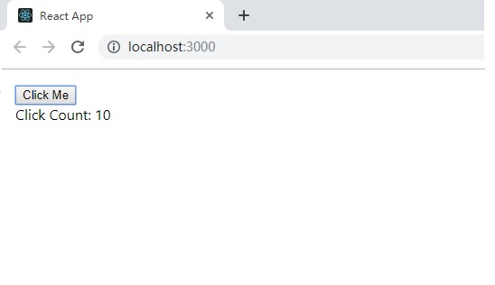

- 第1章

    - 启动
    
        安装node和npm，再安装create-react-app，通过`create-react-app first-react-app`，来创建一个名为
        first-react-app的项目，进入项目中，运行`npm start`启动项目，在浏览器中输入`localhost:8080`就能看到
        项目的页面了
        
        
    - 新增一个react组件
        
        react的首要思想是用组件来开发应用，观察[index.js](chapter-01/first_react_app/src/index.js)文件，中间代码如下
        ```
        import React from 'react';
        import ReactDOM from 'react-dom';
        import './index.css';
        import App from './App';
        import * as serviceWorker from './serviceWorker';
        
        ReactDOM.render(<App />, document.getElementById('root'));
        ```
        这段代码所做的事情就是渲染一个名叫App的组件，该组件被定义在了[App.js](chapter-01/first_react_app/src/App.js)中，该组件
        渲染出的效果就是上图中的界面。
        
        现在我们来自定义一个能够计算点击数的新组件，修改[index.js](chapter-01/first_react_app/src/index.js)
        ```
        import React from 'react';
        import ReactDOM from 'react-dom';
        import ClickCounter from './ClickCounter';
        import './index.css';
        
        ReactDOM.render(
          <ClickCounter/>,
          document.getElementById('root')
        );
        ```
        新增一个[ClickCounter.js](chapter-01/first_react_app/src/ClickCounter.js),此时的页面会进行热更新为
        
        一个带有交互功能的组件已经构建完成，现在来解析ClickCounter中的代码,先是在index.js中
        `import ClickCounter from './ClickCounter';`引入了该组件，在ClickCounter.js中的第一行
        `import React, { Component } from 'react';`来引入react库中的React和Component。
        
        Component是所有组件的基类，`class ClickCounter extends Component {...}`来声明一个组件类，而第一行引入的
        React类是用来处理组件中render()方法里的JSX表达式。
        
     -  JSX
     
        即JavaScript的语法扩展(eXtension),让我们在JavaScript中可以编写HTML代码，JSX中的元素不仅局限于HTML标签，也可以
        是React组件，例如index.js中的`ReactDOM.render(  <ClickCounter/>,  document.getElementById('root') );`中的第一个标签。
        
        *React判断一个元素是HTML还是React组件的原则就是看第一个字母是否大写！*
        
        JSX可以通过`onClick`来给元素添加一个事件的处理函数，之前的设计原则是把HTML、css和Js分开来管理，但在JSX中
        则是把实现同一个功能的代码集中在了一起。但是JSX中的onClick和HTML中直接写onclick还是有很大的区别，
        1. onclick是在全局环境下执行的，容易污染全局环境，产生意想不到的后果
        2. 为很多元素添加onclick会影响页面的性能，要处理的事件函数越多，性能越低。
        3. 删除包含onclick函数的元素，需要把对应的事件处理器注销，如果忘了注销会引起内存泄露。
        
        而JSX中的onClick则不存在上述问题，onClick挂载的每个函数都控制在组件范围内，不会污染全局空间，它是通过
        事件委托（event delegation）的方式处理点击事件，所有的点击事件都被同意挂载到DOM上一个顶级节点，然后根据
        点击的target分发给对应的元素。
        
        除了定义交互行为，也可以定义样式
        ```
            render() {
                const counterStyle = {
                    margin: '16px'
                }
                return (
                    <div style={counterStyle}>
                        <button onClick={this.onClickButton}>Click Me</button>
                        <div>
                            Click Count: <span id="clickCount">{this.state.count}</span>
                        </div>
                    </div>
                );
            }
        ```
    - 分解React应用
       
       观察[package.json](chapter-01/first_react_app/package.json),
       ```
          "scripts": {
            "start": "react-scripts start",
            "build": "react-scripts build",
            "test": "react-scripts test",
            "eject": "react-scripts eject"
          },
       ```
       可以看到，`npm start`其实调用了`react-scripts`这个命令，我们可以在node_module/react-scripts目录下看到，
       还有一个eject命令，通过`npm run eject`启动，运行之后会把一系列技术栈的配置弹射到应用的顶层。
       
    - React的工作方式
       
       如果用jQuery来实现上面的点击效果我们可能会写这么一段代码
       ```
        $(function() {
            $('#clickMe').click(function(){
                var clickCounter = $('#clickCount);
                var count = parsrInt(clickCounter.text(),10);
                clickCounter.text(count+1);
            });
        });
       ```
       jQuery的解决方案是通过CSS的规则找到对应id的按钮。添加上匿名的处理函数，来修改对应DOM元素的文本，这样的代码直观且
       易于理解，但是项目规模增大之后会造成代码结构复杂难以维护。
       
       而React则无需一步一步来手动实现这个过程，只需要告诉React我想要什么样的显示效果即可。它的理念，总结起来就是
       `UI=rendern(data)`,用户看到的界面UI一个应该是函数render的执行结果，对于开发者而言，应该区分哪些是render，哪些是data。
       这就是响应式编程(Reactive Programming)的思想。
       
    - Virtual DOM
           
       要了解虚拟DOM就要先了解DOM，DOM是结构化文本的抽象表达形式，HTML中的每个元素都对应DOM中的一个节点，形成了一个树形
       的结构，成为DOM树。浏览器会根据DOM树渲染出用户看到的界面，当需要改变界面时，就回去改变DOM树上的节点。在前端
       开发时，需要尽量减少DOM操作。即使是一句简单的JS语句，浏览器也需要对网页重新布局，重新绘制。
       
       JSX虽然看起来是HTML，但最终会被Babel解析为一条条创建React组件或者HTML元素的语句，React并不是通过这些
       语句直接构建DOM树，而是先构建一个虚拟DOM。
       
       虚拟DOM并不涉及浏览器的部分，只是一个JavaScript空间的树形结构，每次渲染组件时，会对比这次产生的虚拟DOM和
       上一次渲染的虚拟DOM，发现两棵虚拟DOM树的区别，然后一次性将这些差别修改到真正的DOM树上。

- 第2章 设计高质量的React组件

     - React组件的数据
     
     React组件的数据分为两种，prop和state，无论prop或者state的改变，都可能引发组件的重新渲染。prop是组件
     对外的接口，state是组件的内部状态，对外用prop，对内用state。
     
     新建一个ControlPanel的项目来演示属性的使用。
     
     在React中，prop是从外部传递给组建的数据，一个React组件通过定义自己能接受的prop就定义了自己的
     对外的公共接口。每个组件都是独立的模块，组件之外的一切都是外部世界，外部世界需要通过prop来和组件
     对话。
     
     1. 给prop赋值
         ```
            <SampleButton 
                id="sample" borderWidth={2} onClick={onButtonClick}
                style={{color:"red"}}
            />
         ```
         在上面的代码中，创建了一个名为SampleButton的组件实例，使用了名为id、borderWidth、onClick
         和style的prop，目前来看，React和HTML元素的属性还很相似。不过React的prop除了可以是字符串，也可以是
         任意一种JavaScript支持的数据类型。borderWidth是数字，onClick是函数类型，style是一个对象，如果
         prop的值不是字符串时，就需要用`{}`来包住prop的值。
         
         外部世界要传递值给组件，最简单的方式就是通过prop，同样组件要把数据反馈给外部也用通过prop。函数类型的
         prop等于让父组件交给了子组件一个回调函数，子组件在恰当的实际调用函数类型的prop，带上必要的参数，就反过来
         把信息传递给了外部世界。
         
         对于Counter组件，父组件ControlPanel就是外部世界，看一下ControlPanel是如何用prop传递信息给
         Counter的
         ```
            class ControlPanel extends Component {
              render() {
                return (
                  <div>
                    <Counter caption="First" initValue="{0}"/>
                    <Counter caption="Second" initValue={10} />
                    <Counter caption="Third" initValue={20} />
                  </div>
                );
              }
            }
         ```
         ControlPanel组件包含了三个Counter组件实例，在ControlPanel的render函数中将这三个子组件用div包起来，
         因为React要求render只能返回一个元素。在每个Counter都有名为initValue和caption的prop。
     
     2. 读取prop的值：
         ```
        class Counter extends Component {
          constructor(props) {
            super(props);
        
            this.onClickIncrementButton = this.onClickIncrementButton.bind(this);
            this.onClickDecrementButton = this.onClickDecrementButton.bind(this);
        
            this.state = {
              count: props.initValue
            }
          }
          
            componentWillReceiveProps(nextProps) {
              console.log('enter componentWillReceiveProps ' + this.props.caption)
            }
         }
         ```
         如果一个组件需要定义自己的构造函数，则第一行一定要加上super来调用父类的构造函数。不加的话就无法通过
         this.props访问到父组件传递过来的props的值。
         
         在构造函数中通过props来获取传入的prop值，在其他方法中通过this.props来获取传入的值。
         
         React通过propTypes来限定传入的prop的规格
         ```
            Counter.propTypes = {
              caption: PropTypes.string.isRequired,
              initValue: PropTypes.number
            };
         ```
         这里规定了传入的caption是字符类型且是必须的，initValue则必须是数字类型。
         这种类型限定在开发阶段是有意义的，但是在生产环境下就可以去除了。
    
    - React的state
    
        state代表组件内部的状态。由于React组件不能修改传入的prop，所以需要记录自身数据变化，
        就要使用state。在Counter组件中，最初显示初始计数，这个数字来自prop，当用户点击按钮改变
        这个数字时就要Counter自己通过state来存储。
        
        1. 初始化statr
            ```
            coonstructor(props) {
                ...
                this.state = {
                    count: props.initValue || 0
                }
            }
            ```
            组件的state必须是一个javascript对象，因此哪怕只是一个数字类型也需要用对象进行封装。
        
        2. 读取和更新state
        
            通过给button挂载的onClick事件来处理state
            ```
              onClickIncrementButton() {
                this.setState({count: this.state.count + 1});
              }
            
              onClickDecrementButton() {
                this.setState({count: this.state.count - 1});
              }
            ```
            this.state可以读取到当前组件的state，但是要改变state的值必须通过this.setState函数，而不能
            直接修改state对应的属性的值，因为直接修改值不会驱动对组件的重新渲染。
            
     - prop和state对比
     
        1. prop用于定义外部接口，state用于记录内部状态
        2. prop的赋值在外部世界使用组件时，state的赋值在组件内部
        3. 组件不应该改变prop的值，而state存在的目的就是让组件改变
        
    - 组件的生命周期
    
        React严格规定了组件的生命周期，大致经理下面三个过程，装载过程，更新过程，卸载过程
        1. 装载过程：
            当组件第一次被渲染的时候，依次会经历如下的函数调用
            constructor、getInitialState、getDefaultProps、componentWillMount、render、componentDidMount。
            - constructor，也是ES6中每个类都会有的构造函数，不是所有组件都需要构造函数，除了以下的目的，一是
            初始化state，二是绑定成员函数的this环境
            ```
             constructor(props) {
                ...              
                this.onClickIncrementButton = this.onClickIncrementButton.bind(this);
                this.onClickDecrementButton = this.onClickDecrementButton.bind(this);
                ...
              }
            ```
            这样以确保方法被调用时始终指向当前实例。
            
            - getInitialState和getDefaultProps，用来初始化state和prop，只有在通过React.createClass方法创建组件时
            才会被调用，该方法已经被弃用。
            
            - render 返回一个JSX元素，交由React渲染
            
            - componentWillMount和componentDidMount，在装载过程中，componentWillMount会在调用render函数之前
            被调用，componentDidMount会在调用render函数之后被调用，这两个函数就像render的前哨和后卫，较为有用
            的是componentDidMount函数，当组件渲染完成时就会调用该方法，此时我们就可以利用注入jQuery之类的库
            来操作DOM元素。
        2. 更新过程
        
            当组件被装载到DOM树上之后，用户在网页上可以看到组件的第一印象，但是要提供更好的交互体验，就要让该组件可以
            随着用户操作改变展现的内容，当props或者state修改的时候，就会引发组件的更新过程。
            
            更新过程会依次调用下面的生命周期函数，其中render函数和装载过程一样没有差别，componentWillReceiveProps、
            shouldComponentUpdate、componentWillUpdate、render、componentDidUpdate。
            
            - componentWillReceiveProps(nextProps) ，当父组件调用render函数，无论props是否发生改变，都会
            出发子组件的这个函数，注意this.setState不会触发这个方法，否则就存在死循环了。其传入的参数nextProps
            是当前的最新值，this.props是操作前的值，两者不同才有必要通过setState更新组件。
            
            - shouldComponentUpdate(nextProps,nextState) 这可能是除了render之外最重要的一个函数，render决定了
            要渲染成什么样，而shouldComponentUpdate决定了组件是否需要渲染。
            
                render和shouldComponentUpdate也是唯二明确要求有返回值的函数。render函数的返回结果用于构造DOM对象，而shouldComponentUpdate函数返回
            一个布尔值，告诉React库这个组件在这次更新过程中是否要继续执行render。对于不需要渲染的组件阻止它的默认渲染可以提升整体效率。
            ```
              shouldComponentUpdate(nextProps, nextState) {
                return (nextProps.caption !== this.props.caption) ||
                    (nextState.count !== this.state.count);
              }
            ```
            通过nextProps和this.props以及nextState和this.state的对比来判断是否需要渲染。
            
            - componentWillUpdate和componentDidUpdate 如果上一个函数返回true，接下来就会调用这两个方法
            
        3. 卸载过程 
        
           React的卸载过程只涉及一个函数，componentWillUnmount，当组件将要从DOM树上删除之前，会调用这个方法，
           该方法适合做一些清理的工作。
           
    - 组件向外传递数据
    
        通过ControlPanel和Counter已经知道了父组件如何通过prop把数据传递给子组件，而子组件是如何将数据传递到
        父组件呢。解决的方法依然是利用prop。把一个函数通过prop传递给子组件。
        
        新建一个control_with_summary项目，Counter组件中的关键代码如下
        ```
            onClickDecrementButton() {
                this.updateCount(false);
            }
        
            updateCount(isIncrement) {
                const previousValue = this.state.count;
                const newValue = isIncrement ? previousValue + 1 : previousValue - 1;
        
                this.setState({count: newValue})
                this.props.onUpdate(newValue, previousValue)
            }
        ```
        现在onClickIncrementButton函数和onClickDecrementButton的任务除了调用this.setState改变内部状态，还要调用
        this.props.onUpdate这个函数，对应的，Counter组建的propTypes和defaultProps就要增加对onUpdate的定义
        ```
        Counter.propTypes = {
          caption: PropTypes.string.isRequired,
          initValue: PropTypes.number,
          onUpdate: PropTypes.func
        };
        
        Counter.defaultProps = {
          initValue: 0,
          onUpdate: f => f //什么都不做的函数
        };
        ```
        这样Counter的onUpdate就成了作为子组件的Counter向父组件ControlPanel传递数据的渠道。ControlPanel也要做一些
        修改，现在ControlPanel需要包含自己的state
        ```
          constructor(props) {
            super(props);
            this.onCounterUpdate = this.onCounterUpdate.bind(this);
            this.initValues = [ 0, 10, 20];
            const initSum = this.initValues.reduce((a, b) => a+b, 0);
            this.state = {
              sum: initSum
            };
          }
        ```
        
    - React组件state和prop的局限
    
    我们在Counter中有每个状态的当前计数，在ControlPanel中又有一个计数的总和，因此数据
    发生了重复。重复数据如何保持一致就是一个问题了。逻辑上应该相同的状态，拆分到
    不同组件中就会存在这个问题。
    
    一种可靠的办法就是将数据提升到全局，让各个组件和全局保持一致即可，这样也容易控制，这就是
    Flux和Redux中Store的概念。
    
    利用prop中转数据也会存在问题，当存在三级组件，中间的组件就不得不成为中转站，而它可能本身
    并不使用中转的数据，第3章将会解决这个问题。
    
- 第3章 从Flux到Redux

    Flux的思想是更严格单向数据流
    
    
    - Dispatcher 处理动作分发，维持Store之间的依赖关系
    - Store 负责存储数据和处理数据相关逻辑
    - Action 驱动Dispatcher的Javascript对象
    - View 视图部分
    
    我们把之前的案例用flux进行数据管理，首先在项目中引入flux
    ，在项目下执行`npm install --save flux`
    
    1. Dispatcher 首先要创建一个Dispatcher类， 在[AppDispatcher.js](chapter-03/flux/src/AppDispatcher.js)
    中引入flux库中的，该类的唯一作用就是分发各种action
    
    2. action，即动作，这只是一个普通的JavaScript对象，代表一个纯数据。为了管理，action对象
        必须有一个type字段，代表着action对象的类型。
    
        定义action通常需要两个文件，一个定义action的类型，一个定义action的构造函数（也称为action creator）。
        分成两个文件的主要原因是Store中会根据action类型做不同操作，也就有单独导入action类型的需要。
        
        在[ActionTypes.js](chapter-03/flux/src/ActionTypes.js)中定义action的类型
        ```
        export const INCREMENT = 'increment';
        export const DECREMENT = 'decrement';
        ```
        此处定义了两个action类型，INCREMENT和DECREMENT。
        现在再定义action的构造函数，在[Action.js](chapter-03/flux/src/Actions.js)中
        ```
        export const increment = (counterCaption) => {
          AppDispatcher.dispatch({
            type: ActionTypes.INCREMENT,
            counterCaption: counterCaption
          });
        };
        export const decrement = (counterCaption) => {
          AppDispatcher.dispatch({
            type: ActionTypes.DECREMENT,
            counterCaption: counterCaption
          });
        };
        ```
        这个文件中导出了两个action的构造函数，当被调用时将会创造对应的action对象，并
        立即通过AppDispatcher.dispatch分发出去。派发出去的action接下来将会进入Store
        
     3. Store,也是一个对象，用于存储应用状态，同时接受Dispatcher派发的动作，根据动作
        来决定是否要更新应用状态，现在我们创造两个Store，一个为Counter组件服务的CounterStore，另一个就是为
        CounterPanel服务的SummaryStore。
        
        [CounterStore.js](chapter-03/flux/src/stores/CounterStore.js),当Store的状态发生变化的
        时候，需要通知应用的其他部分做出响应。最重要的一个步骤是把这个Store注册到AppDispatcher上

        另一个Store，[SummaryStore.js](chapter-03/flux/src/stores/SummaryStore.js)则并没有存储自己的
        状态，当getSummary被调用时，则是直接获取CounterStore中的数据进行计算。  
        
    4. View，理论上视图部分可以用任意的UI库完成。
    
   
   - Flux的优势
   
     之前的例子，应用的状态数据只存在于React组件中，每个组件需要维护驱动自己渲染的状态数据，
     单个组件的状态好维护，但是多个组件如果存在状态的关联就比较麻烦了。React只提供了props来
     进行组件之间的通信，一旦关系复杂就显得很笨拙。
     
     Flux架构下，应用的状态放在了Store中，React只扮演了View的部分，被动根据Store的状态来渲染。
     从通过this.setState改变组件的状态，到Flux的版本中，用户操作引发一个动作，派发给所有的Store对象
     ，引起Store状态的改变，组件的状态是Store状态的映射，也就自然发生了改变。
     
   - Redux
   
        2015年在Flux基础上改进出了Redux，Redux在此基础上强调三个基本原则
        - 唯一数据源（Single Source of Truth）：应用的状态应该存储在唯一的一个Store上，不同于Flux中允许存在多个Store，避免了
        造成数据冗余，而且不同数据Store之间产生依赖关系会增加复杂度。这个唯一的Store是一个树形的对象，每个组件往往只是用树形对象
        上一部分的数据，而如何设计Store上状态的结构，就是Redux的核心问题。
        - 保持状态只读（State is read-only）：要修改Store的状态，必须要通过派发一个action对象来完成，这个Flux没有区别。
        - 数据改变只能通过纯函数完成（Changes are made with pure functions）：这里所说的传函数就是Reducer，Redux就是Reducer+Flux。
        在Redux中，每个reducer的函数签名如下：`reducer(state,action)`，第一个state是当前的状态，第二个参数
            是接收到的action对象，reducer要做的事情就是根据state和action的值产生一个新的对象返回，注意reducer必须是
            一个纯函数，也就是说函数的返回结果必须完全由参数state和action决定，而不产生任何副作用，也不能修改state和
            action对象。
            
   和Flux一样，Redux把action类型和action构造函数分成两个文件定义，[ActionTypes.js](chapter-03/redux_basic/src/ActionTypes.js)和
   Flux没有区别，但[Actions.js](chapter-03/redux_basic/src/Actions.js)就不大一样了
   ```
   Flux:
   export const increment = (counterCaption) => {
     AppDispatcher.dispatch({
       type: ActionTypes.INCREMENT,
       counterCaption: counterCaption
     });
   };
   Redux:
   export const increment = (counterCaption) => {
        return {
          type: ActionTypes.INCREMENT,
          counterCaption: counterCaption
        };
   };
   ```
   Redux中的构造函数会返回一个action对象，而Flux中会调用Dispatcher的dispatch函数分发出去。
   
   [Store.js](chapter-03/redux_basic/src/Store.js)，这个文件会输出全局唯一的那个Store，代码如下
   ```
   import {createStore} from 'redux';
   import reducer from './Reducer.js';
   const initValues = {
     'First': 0,
     'Second': 10,
     'Third': 20
   };
   const store = createStore(reducer, initValues);
   export default store;
   ```
   Redux库提供了createStore函数，这个函数第一个参数代表更新状态的reducer，第二个参数是状态的初始值，第三个参数可选，
   代表Store Enhancer。确定Store的状态是设计好Redux应用的关键。接下来是[Reducer.js](chapter-03/redux_basic/src/Reducer.js)，
   reducer函数中往往包含以action.type为判断条件的if-else语句。
   
   `return {...state, [counterCaption]: state[counterCaption] + 1};`代码中使用三个句点代表扩展操作符（spread operator），
   表示把state中的所有字段展开，而后面对counterCaption值对应的字段会赋上新值，上面的逻辑等同于
   ```
    const newState = Object.assign({},state);
    newState[counterCaption]++;
    return newState;
   ```
   
   在Redux框架下一个React组件基本要完成两个功能
   - 和Redux Store打交道，读取Store的状态用来初始化组件，同时监听Store状态发生的改变来更新组件的状态，
   如果要更新Store状态，就要派发action对象
   
   - 根据当前prop和state，渲染用户界面。
   
   当一个组件需要完成两件事时则可以考虑拆分，分别承担一个任务，然后把两个组件嵌套起来，
   完成一个原本组件完成的所有任务。业界对于这样的拆分，承担第一个负责和redux store打交道
   的组件叫容器组件（Container Component）；对于承担第二个渲染任务的组件叫做展示组件（Presentational Component）
   
   
   我们通过例子redux_smart_dumb来感受一下这种模式。只有视图部分的代码发生了改变，在[Counter.js](chapter-03/redux_smart_dumb/src/views/Counter.js)中一个是Counter，
   一个是CounterContainer
   
   Counter组件的功能非常简单，只有一个render函数
   ```
    class Counter extends Component {
      render() {
        const {caption, onIncrement, onDecrement, value} = this.props;
        return (
          <div>
            <button style={buttonStyle} onClick={onIncrement}>+</button>
            <button style={buttonStyle} onClick={onDecrement}>-</button>
            <span>{caption} count: {value}</span>
          </div>
        );
      }
    }
   ```
   Counter组件完全没有state，所有状态都来自于props，这种组件叫做无状态组件。而CounterContainer承担了所有
   和Store的数据交互，它的render函数需要做的就是渲染傻瓜组建Counter，传递必要的props。
   ```
    class CounterContainer extends Component {
          render() {
            return <Counter caption={this.props.caption}
              onIncrement={this.onIncrement}
              onDecrement={this.onDecrement}
              value={this.state.value} />
          }
    }
    
    export default CounterContainer;
   ```
   这个文件最后导出的也是CounterContainer，也就是说外界不会感受到Counter的存在。
   
   
- 组件Context

    重新观察Counter和Summary组件，发现他们都直接导入了Store.js，一个应用中，最好只有
    一个地方导入Store，并将其放在最顶层，React提供了Context，即上下文环境，让一个树状组件上所有
    组件都能访问同一个对象。
    
    上级组件需要宣称自己支持context，并且提供一个函数是来返回代表Context的对象，它的子级组件只要宣称
    自己需要这个context，就可以通过this.context来访问这个共同的环境对象。
   
   新建项目redux_with_context来演示该功能，创建一个特殊的React组件，它将是一个通用的context提供者，可以应用在
   任何一个应用中，新建[Provider.js](chapter-03/redux_with_context/src/Provider.js)，它的render函数就是简单的把
   子组件渲染出来，每个React组件的props都有一个特殊属性children，代表的是子组件。Provider中另一个重要的函数
   getChildContext返回的就是代表context的对象。Provider还需要定义childContextTyoes，必须和getChildContext对象，只有
   两者齐备才能访问到context。
   
    - React-Redux
    
    无论是把React组件拆分为聪明和傻瓜组件，还是利用Context来访问数据，都是一种套路，既然是
    套路就可以把套路部分提取出来复用，利用react_redux库可以直接实现这两个功能。
    
    1. connect
    
    以Counter为例，和redux_with_context不一样，react_redux中没有定义CounterContainer这样的聪明
    组件，而是直接导出了这样的一个语句`export default connect(mapStateToProps, mapDispatchToProps)(Counter);`
    connect接受两个参数，返回值仍然是一个函数，所以这句话并没有语法错误，connect函数主要做了两件事，第一是
    把Store里的数据转化成傻瓜组件的prop，第二则是把傻瓜组件的action派发给Store。
    
    2. Provider
    
    和在reux_with_context中定义的Provider几乎相同，但是react_redux提供的更加严格。 
    
    - 小结
    
        本章从Flux框架出发，到Redux，了解了Redux强调单一数据源、保持状态只读，只能通过纯函数
        改变的基本原则。 
------
    
- 第4章 模块化React和Redux应用 

    本章将会创建一个复杂一点的应用，主要包含
    1. 模块化应用的要点
    2. 代码文件的组织方式
    3. 状态树的设计
    4. 开发辅助工具
        
   - 模块化应用要点
   
   从架构出发，当开始一个新的应用的时候，有几件事一定要考虑清楚
   1. 代码问价你的组织结构
   2. 确定模块的边界
   3. Store的状态树的设计
   
   这三件事是构建一个应用的基础。本章我们将建造一个TodoList应用。
   
   代码的组织形式无外乎按照角色组织和按照功能组织两种形式，React应用会依然按照“按功能组织”的
   方式。
   
   Store的状态树设计，直接决定了要写哪些reducer，还有action怎么写，
   设计状态树主要有如下几个原则
   1. 一个模块控制一个状态节点
   2. 避免冗余数据
   3. 树形结构扁平化
   
   状态树的设计
   ```
   {
    todos:[
        {
            text:'First todo',
            completed:true,
            id:0
        },
        {
            text:'Second todo',
            completed:false,
            id:1
        }
    ],
    filter:'all'
   }
   ```
   每增加一个待办事项就在数据类型todos中增加一个元素。在应用的入口文件[src/index.js](chapter-04/todo/src/index.js)中，和
   ControlPanel一样，用Provider包住最顶层的TodoApp模块
   ```
    ReactDOM.render(
      <Provider store={store}>
        <TodoApp />
      </Provider>,
      document.getElementById('root')
    );
   ```
   TodoApp组件所要做的就是把两个关键视图显示出来。在todos和filter中各有一个reducer来处理action，然后createStore
   只能接收一个reducer，所以需要利用combineReducers来将多个reducer合成为一个。我们通过ES6的扩展操作符简化了
   reducer的代码，扩展操作符可以用来扩展一个数据，加入state是一个数组，想要返回增加了一个对象的数据，可以这样写
   `return [newObject,...state]`，为什么不用push或者unshift呢，因为这样会改变原来那个数组，而reducer要求
   必须是纯函数，不能有任何副作用，包括不能修改参数对象。注意reducer中switch必须加上default并将state原样返回，
   因为reducer会接收到任意action。
   
   接着就是视图部分，AddTodo组件设计处理用户输入。当用户点击“增加”按钮或者在输入栏input中
   回车时需要读取这个DOM元素中的值，为了支持这个功能，React提供了一个叫ref的功能。
   ```
        render() {
            return(
                <div className="add-todo">
                    <form onSubmit={this.onSubmit}>
                        <input className="new-todo" ref={this.refInput} />
                        <button className="add-btn" type="submit">
                            添加
                        </button>
                    </form>
                </div>
            );
        }
        
        refInput(node) {
            this.input = node;
        }
   ```
   当一个元素包含ref属性时，在完成装载时(mount)，会看ref属性是不是一个函数，如果是，就会调用这个函数，参数
   就是这个组件代表的DOM元素，注意不是虚拟DOM，因此我们可以通过代码实际访问到DOM元素。在todoList组件上，
   因为要根据todo数据的长度来渲染，而我们不能用for 或者while之类的循环拼接，因为这些是语句而不是表达式。
   ```
    const TodoList = ({todos, onToggleTodo, onRemoveTodo}) => {
      return (
        <ul className="todo-list">
        {
          todos.map((item) => (
            <TodoItem
              key={item.id}
              text={item.text}
              completed={item.completed}
              onToggle={() => onToggleTodo(item.id)}
              onRemove={() => onRemoveTodo(item.id)}
            />
            ))
        }
        </ul>
      );
    };
   ```
   循环出来的子组件上必须确保每一个都有key来表示这个唯一的子组件.
   
   在前面的例子中，通过ref来访问DOM元素，这种用法是非常脆弱的，因为React的产生就是
   为了避免直接操作DOM而降低性能，我们可以利用组件的状态来同步记录DOM元素的值，这种
   方法可以控制组件不使用ref
   
  
        
   
         
        
                    
            
            
            